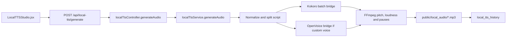
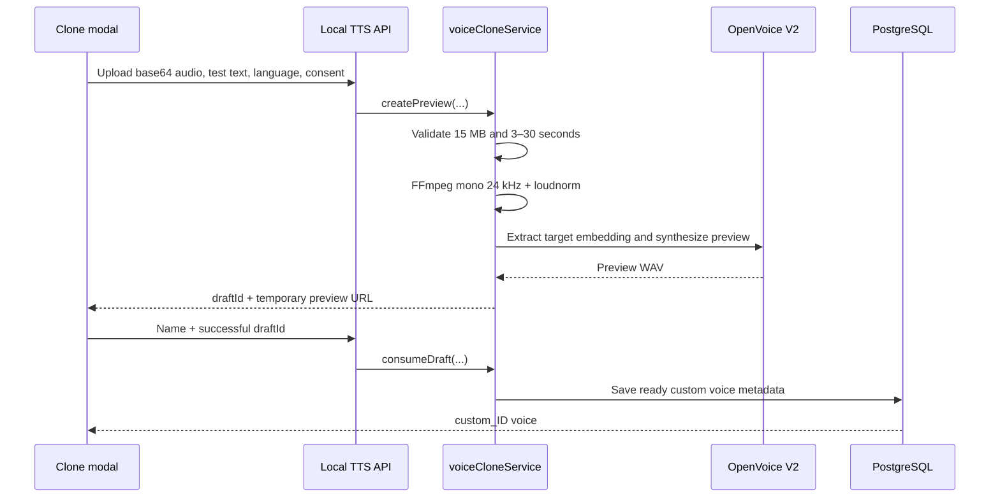

# IIG AI System

Internal Digital Product Department workspace. This repository contains the AI scoring administration application and content tools, including Audio Studio.

> Start here when using an AI coding assistant: read this file, then `CODING_STANDARDS.md`. For deeper Audio Studio product rules, read `LOCAL_TTS_MODULE_SPEC.md`. Do not assume that Voice Cloning is production-ready; its current state is documented below.

## Quick start

Requirements:

- Node.js and npm
- PostgreSQL
- FFmpeg and FFprobe
- The existing Kokoro runtime in `tts_env/`

```bash
cp .env.example .env
npm install
npm --prefix frontend install
npm start
npm --prefix frontend run dev
```

Backend defaults to the configured `PORT`; Vite proxies API and generated media requests to `http://localhost:5005` unless `VITE_API_PROXY_TARGET` is set.

Verification:

```bash
npm run check
```

This runs backend syntax checks and tests, frontend lint, and the production frontend build.

## Application structure

```text
frontend/src/
  App.jsx                                  route and permission guard
  components/layout/Sidebar.jsx            Audio Studio navigation entry
  components/local-tts/
    LocalTTSStudio.jsx                     complete Audio Studio UI and state
    LocalTTSStudio.css                     primary layout and components
    LocalTTSStudioTypography.css           module typography
    LocalTTSHistory.css                    history/detail presentation
    LocalTTSClone.css                      voice-cloning modal presentation

src/
  app.js                                   Express mount and static media paths
  routes/localTtsRoutes.js                 authenticated Audio Studio endpoints
  controllers/localTtsController.js        HTTP request/response adapter
  services/localTtsService.js              orchestration, FFmpeg, persistence
  services/voiceCloneService.js            optional OpenVoice adapter and drafts
  models/kokoro/
    kokoro_batch_bridge.py                 batch synthesis and voice mapping
    kokoro-v1.0.onnx                       Kokoro model
    voices-v1.0.bin                        Kokoro voice packs
  models/openvoice/openvoice_bridge.py     optional OpenVoice/MeloTTS bridge
  database/migrations/
    003_local_tts.sql                      base Audio Studio tables
    007_local_tts_history_metadata.sql     history engine/settings metadata
    008_local_tts_legacy_compatibility.sql legacy schema compatibility
    009_voice_clone_engine.sql             clone engine/status metadata

public/
  local_audio/                             final generated MP3 files
  local_voices/                            persisted reference voice files
  tmp_local/                               temporary previews and segments
```

## Báo cáo KPI

Route: `/reports/kpi`

Module báo cáo Phase 1 cho phép tài khoản có `reports.upload` chọn kỳ, upload file `.xlsx`, `.xlsm` hoặc `.xls`, xem cảnh báo/preview và xác nhận đồng bộ. Backend đọc KPI từ `98_DATA_EXPORT`, dữ liệu chi tiết từ 6 sheet nghiệp vụ, sau đó publish toàn bộ kỳ trong một PostgreSQL transaction. Dashboard chỉ đọc version đã publish.

Permissions:

- `reports.view`: xem dashboard và lịch sử đồng bộ.
- `reports.upload`: kiểm tra và commit file Excel.
- `reports.manage`: quyền quản trị kỳ/cấu hình dành cho các bước tiếp theo.

API prefix: `/api/reports` với các endpoint `bootstrap`, `dashboard`, `imports`, `imports/inspect` và `imports/:id/commit`.

## Audio Studio

Route: `/local-tts`

Audio Studio creates English passage or multi-speaker dialogue audio locally. It does not call an external AI API.

### Permissions

- `audio.view`: open Audio Studio, list engines/voices, and view history.
- `audio.manage`: generate/delete audio and manage cloned voices.
- Frontend visibility is a convenience only. Every API action is checked again by `authenticate` and `requirePermission` on the backend.

Permission definitions live in `src/modules/auth/permissions.js`. Default role assignments are created by migration `006_role_permissions.sql`.

Users can hold multiple roles through the `user_roles` join table introduced by
`029_user_multiple_roles.sql`. The migration backfills every legacy `users.role`
assignment and keeps that column temporarily as the primary-role compatibility
field. Effective permissions are the de-duplicated union of all assigned roles;
API authorization always reloads these assignments from PostgreSQL so changes
take effect on the next authenticated request.

### Generation flow



1. The frontend sends a title, `content_type`, script and global settings.
2. A passage with one large text block is split into sentences so pauses can be applied consistently.
3. Empty lines are removed. Each built-in line is written into one Kokoro batch job.
4. `kokoro_batch_bridge.py` maps the UI voice identifier to a real Kokoro voice pack and generates one WAV per line.
5. Custom voice lines, when the optional engine is ready, use `voiceCloneService.synthesize` instead.
6. FFmpeg applies pitch adjustment and loudness normalization, inserts silence files between lines, then concatenates everything into the final MP3.
7. The final public path and the complete original configuration are persisted in PostgreSQL.

### Voice identity

Built-in display names such as Andrew or Ava are stable application IDs, not Microsoft Edge TTS calls. `VOICE_MAP` in `kokoro_batch_bridge.py` maps them to Kokoro voice packs such as `am_adam` and `af_heart`.

All built-in voices share the same Kokoro 82M ONNX model. A voice pack supplies different learned speaker/timbre conditioning. When adding or renaming a UI voice, update both `getVoices()` in `localTtsService.js` and `VOICE_MAP` in the Python bridge.

### Style, speed, pitch and pause

- Style is implemented by `expressive_text()` in the Kokoro bridge. `question`, `excited`, `thoughtful`, and `serious` alter punctuation/prosodic cues before synthesis. It is not a separate emotion model.
- Speed is passed to Kokoro and clamped to `0.7–1.3`. UI percentage values are converted to a multiplier.
- Pitch is post-processed by FFmpeg using `asetrate`, `aresample`, and compensating `atempo`, followed by `loudnorm`. The UI uses an Hz-like control but the service converts its value into an internal pitch factor.
- Pause is actual generated silence. `pause_after_ms` on a line overrides `pause_between_ms`; no pause is appended after the last line.

### History and storage

`local_tts_history` stores metadata, not the binary audio file:

- `title`, `content_type`, and `language`
- full `raw_script` JSON, including speaker, selected voice, style, rate, pitch and pause
- relative `audio_path`
- duration and file size
- engine name and global settings JSON
- creation/update timestamps

The generated MP3 is stored under `public/local_audio`. `GET /history` returns a lightweight paginated list; `GET /history/:id` returns the complete script/configuration. Deleting history also removes its local media file when present.

## Voice Cloning — paused

### Current product state

Voice Cloning is implemented in source but intentionally hidden while its local runtime is unavailable.

- Python 3.9.25 exists in `voice_clone_env/`.
- The `MyShell-OpenVoice` package has been placed in that isolated environment.
- The complete dependency set and official V2 checkpoints are not installed.
- Direct macOS installation was paused because the OpenVoice manifest pins PyAV 10, which is not source-compatible with the installed FFmpeg 8 headers.
- `voiceCloneService.engineInfo().ready` therefore returns `false`.
- The frontend shows the **Sao chép giọng** button only when `cloneEngine.ready === true`.
- Kokoro generation remains fully independent and operational.

Do not change `ready` manually and do not show the feature unconditionally. Readiness must continue to be derived from the actual Python executable, bridge, and converter checkpoint files.

The recommended future deployment is an isolated Linux/Docker runtime using Python 3.9, rather than forcing the legacy PyAV build onto the macOS development host. See `OPENVOICE_SETUP.md` before resuming installation.

### Intended cloning flow



Important invariants:

- Explicit consent is mandatory at both UI and API level.
- Upload limit is 15 MB; accepted reference duration is 3–30 seconds.
- Audio is converted to mono 24 kHz WAV and normalized before embedding extraction.
- A voice cannot be persisted from a raw upload. Saving requires a successful preview draft.
- Preview drafts are memory-only and expire after one hour.
- The old fake Edge TTS fallback was removed. Runtime failure must return an error, never a successful response with a substitute voice.
- Saved references live in `public/local_voices`; database records use the `openvoice-v2` engine and `ready` status.
- During normal generation, a `custom_<database id>` selection resolves its reference file and calls the OpenVoice bridge. Its output then follows the same FFmpeg and concatenation pipeline as built-in voices.

### OpenVoice bridge mechanism

`src/models/openvoice/openvoice_bridge.py` performs these steps:

1. Select CPU, CUDA, or another PyTorch-supported device (current code uses CUDA when available, otherwise CPU).
2. Load the V2 tone-color converter config and checkpoint.
3. Extract the target speaker embedding from the uploaded reference with VAD enabled.
4. Use MeloTTS to create neutral/source speech in the requested language.
5. Load the corresponding base-speaker embedding.
6. Transfer target tone color to the source speech and write the cloned output.

Supported application language codes are `EN`, `ES`, `FR`, `ZH`, `JP`, and `KR`. The bridge maps each code to its checkpoint embedding filename.

## Local TTS API

All endpoints are mounted below `/api/local-tts` and require a JWT session.

| Method | Path | Permission | Purpose |
| --- | --- | --- | --- |
| GET | `/engine` | `audio.view` | Return Kokoro and optional clone-engine readiness |
| GET | `/voices` | `audio.view` | List built-in and ready custom voices |
| POST | `/generate` | `audio.manage` | Generate passage/dialogue audio |
| GET | `/history` | `audio.view` | Paginated lightweight history |
| GET | `/history/:id` | `audio.view` | Complete saved script and settings |
| DELETE | `/history/:id` | `audio.manage` | Delete history row and local file |
| POST | `/preview-cloned-voice` | `audio.manage` | Create an expiring clone preview draft |
| POST | `/clone-voice` | `audio.manage` | Save a successful preview as a custom voice |
| DELETE | `/voices/:id` | `audio.manage` | Delete custom voice row and reference file |

Representative generation body:

```json
{
  "title": "TOEIC Conversation 01",
  "content_type": "dialogue",
  "script": [
    {
      "speaker_name": "Speaker A",
      "text": "Good morning. How may I help you?",
      "voice_id": "en-US-AndrewNeural",
      "style": "question",
      "rate": "+0%",
      "pitch": "+0Hz",
      "pause_after_ms": 450
    }
  ],
  "global_rate": "+0%",
  "global_pitch": "+0Hz",
  "pause_between_ms": 500
}
```

## Environment variables

Core project variables are documented in `.env.example`. Audio-specific optional variables:

```dotenv
OPENVOICE_PYTHON=./voice_clone_env/bin/python3
OPENVOICE_MODEL_DIR=./voice_clone_models
```

These paths do not enable the feature by themselves. The service checks that the Python executable, bridge, and `converter/config.json` exist. The model directory must also contain the official converter checkpoint and base-speaker embeddings described in `OPENVOICE_SETUP.md`.

Never commit `.env`, model environments, checkpoints, generated audio, reference voices, credentials, or user recordings unless an explicit repository policy is added for them.

### Environment and version identity

- Local Vite development defaults to `Dev`; backend uses `APP_ENV=development` and the local `DATABASE_URL`.
- Production builds inject `Production`, the root `package.json` version, and the current short Git commit into the frontend bundle.
- The sidebar displays the environment and version. Backend `/health` returns the same identity under `build`.
- Production must set `NODE_ENV=production`, `APP_ENV=production`, `APP_VERSION`, `APP_COMMIT`, and a JWT secret of at least 32 characters.

## Production backup, data sync and deployment

- `scripts/backup-production.sh` creates a full PostgreSQL custom dump, a focused scoring-data dump, row counts, and a media archive in `.partial-*` directories. It publishes a backup only after manifests and SHA-256 checks pass, removes partial output on failure, and retains the three newest server backups.
- `scripts/sync-production-scoring-to-local.sh` first backs up the local database, exports production scoring rows as portable column inserts, then replaces the four local business tables inside one transaction.
- `deploy.sh` requires a clean, tagged `main` synchronized with `origin/main`, matching backend/frontend versions, at least 2 GB free on production, and an exclusive remote deploy lock. `ALLOW_UNPUSHED_RELEASE=true` is an emergency-only override.
- Releases are immutable under `/opt/ai-scoring-releases/<deploy-id>`. Shared `.env`, generated media, model files, and Python environments remain under `/opt/ai-scoring`; `/opt/ai-scoring-current` points to the active release.
- Activation switches `/opt/ai-scoring-current`, restarts PM2, and verifies the exact production version and commit on port `5005`. A failed identity/health check automatically restores the previous release and restarts PM2.
- A new verified backup is the default. `PREVERIFIED_BACKUP_ID=<id>` reuses a checksum/manifest-backed backup; `SKIP_BACKUP=true` is an explicit emergency choice and prints a warning.
- The three newest immutable releases are retained for fast rollback. Nginx serves the SPA and generated media through `/opt/ai-scoring-current` on port `3100`.

Never put the Hetzner password in any repository file. Provide `VPS_PASSWORD` only in the process environment, or store it in macOS Keychain under service `ai-scoring-vps` and account `root@<VPS_IP>`; `deploy.sh` can read that item without printing the secret.

Development audio storage uses Cloudflare R2 when `AUDIO_STORAGE_MODE=r2`. PostgreSQL stores only an `r2:<object-key>` reference and metadata. The bucket layout mirrors production: `cleaned-audio/` for processed answers, `dialogues/` for generated audio, `question-bank/` for question assets, and `test/` for connectivity checks. Run `npm run audio:migrate-dev-r2` for a dry run and append `-- --apply` to upload existing local files, update their database references, and remove the migrated local copies.

## Database migrations

Migrations run automatically during backend startup through `src/database/migrate.js`. Each SQL filename is recorded in `schema_migrations` and applied once inside a transaction.

Never edit an already deployed migration to change production state. Add the next numbered migration instead.

## Safe extension checklist

When changing Audio Studio:

1. Preserve `audio.view`/`audio.manage` checks on both frontend and backend.
2. Keep API controllers thin; orchestration belongs in services and model-specific work in bridges.
3. Keep database queries parameterized.
4. Do not silently fall back to a different voice or external API.
5. Clean temporary files on both success and failure paths.
6. Persist enough raw configuration to reproduce historical audio.
7. Run `npm run check`.
8. Test light/dark UI, passage/dialogue generation, history restore, and media playback.
9. For Voice Cloning, additionally verify consent, invalid media, duration limits, expired drafts, model failure, save-after-preview, custom voice generation, and deletion.

## Related documentation

- `CODING_STANDARDS.md`: repository-wide architecture and coding rules.
- `LOCAL_TTS_MODULE_SPEC.md`: detailed Audio Studio product and data specification.
- `OPENVOICE_SETUP.md`: expected local OpenVoice runtime contract.
- `db_architecture.md` and `detailed_db_schema.md`: broader database documentation.
