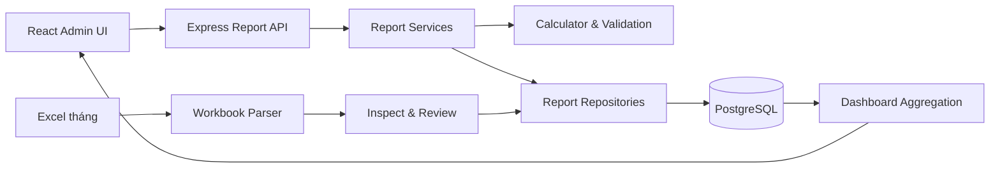
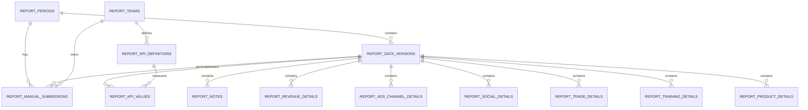
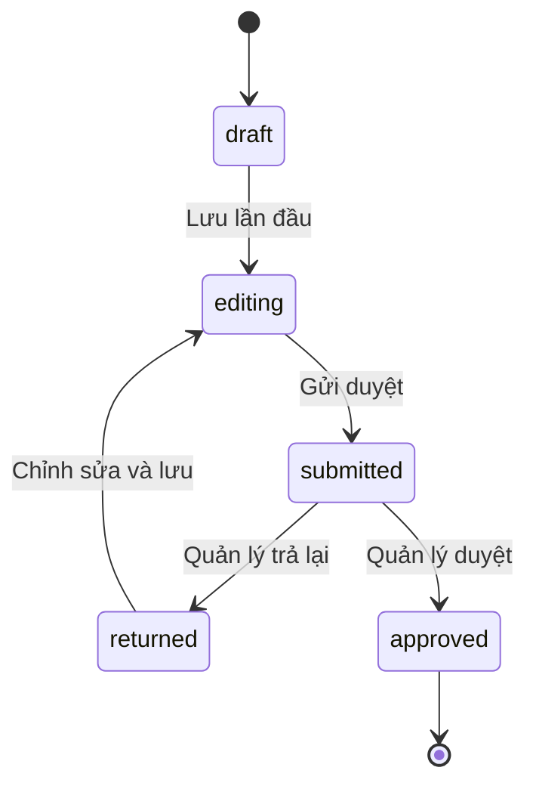

# Báo cáo KPI — Trạng thái, kiến trúc và roadmap

> Cập nhật: 09/08/2026  
> Phạm vi: tính năng **Báo cáo KPI** và **Quản lý báo cáo** trên IIG Admin  
> Trạng thái tổng thể: **Phase 1 đã vận hành; Phase 2.1 đã triển khai trên dev**

## 1. Mục tiêu sản phẩm

Hệ thống thay thế dần luồng báo cáo trên Google Apps Script/Excel bằng một nền tảng tập trung:

1. Tiếp nhận file Excel báo cáo tháng và hiển thị dashboard.
2. Quản lý kỳ báo cáo theo tháng/năm.
3. Cho từng bộ phận nhập dữ liệu trực tiếp trên IIG Admin.
4. Tự động tính KPI, kiểm tra dữ liệu, duyệt và publish lên dashboard.
5. Lưu phiên bản và lịch sử thay đổi để có thể truy vết.

## 2. Trạng thái triển khai

| Hạng mục | Trạng thái | Ghi chú |
|---|---|---|
| Dashboard KPI theo bộ phận | Hoàn thành | Có Overview, Doanh thu, Ads, Truyền thông, Trade, Đào tạo, Sản phẩm |
| Upload một file Excel tổng hợp | Hoàn thành | Chọn tháng/năm, bóc file, review rồi commit |
| Lịch sử đồng bộ Excel | Hoàn thành | Theo dõi file, kỳ, trạng thái và người upload |
| Master KPI và master danh mục | Hoàn thành nền tảng | Lưu tại database, dùng chung cho Excel và nhập trực tiếp |
| Quản lý danh sách kỳ báo cáo | Hoàn thành dev | Tạo kỳ, lọc, xem tiến độ, chi tiết, publish, xóa có điều kiện |
| Sinh phiếu nhập liệu theo bộ phận | Hoàn thành dev | Mỗi kỳ sinh 6 phiếu |
| Nhập thêm/xóa dòng dữ liệu | Hoàn thành dev | Form động theo từng bộ phận |
| Tự tính KPI từ dòng chi tiết | Hoàn thành dev | 35 KPI derived, 12 KPI manual; Doanh thu tổng hợp nhập thủ công |
| Autosave và validation | Hoàn thành dev | Autosave 1,5 giây; lỗi và cảnh báo được lưu |
| Gửi duyệt / trả lại / duyệt | Hoàn thành dev | Workflow theo từng phiếu bộ phận |
| Publish dữ liệu nhập trực tiếp | Hoàn thành dev | Chỉ publish khi đủ 6 phiếu được duyệt |
| Phân công người nhập theo bộ phận | Chưa triển khai | Dự kiến Phase 2.2 |
| Nhắc hạn nhập liệu tự động | Chưa triển khai | Dự kiến Phase 2.3 |
| Khóa/mở lại kỳ qua UI | Chưa triển khai | Database đã có trạng thái, UI chưa có |
| Audit log hiển thị trên UI | Chưa triển khai | Dữ liệu audit đã được ghi tại database |

## 3. Cấu trúc chức năng hiện tại

### 3.1 Menu Báo cáo

- **Dashboard KPI** — `/reports/kpi`
  - Xem tổng quan và KPI từng bộ phận.
  - Upload Excel và xem lịch sử đồng bộ.
  - Xuất báo cáo.
- **Quản lý báo cáo** — `/reports/manage`
  - Danh sách kỳ báo cáo.
  - Tạo kỳ mới hoặc sinh phiếu cho kỳ cũ từ Phase 1.
  - Theo dõi trạng thái và tiến độ duyệt.
  - Publish hoặc xóa kỳ theo rule.
- **Chi tiết kỳ báo cáo** — `/reports/manage/:periodId`
  - Danh sách 6 phiếu bộ phận.
  - Nhập KPI và dữ liệu chi tiết.
  - Nhận xét, gửi duyệt, trả lại, duyệt và publish.

### 3.2 Sáu bộ phận

| Code | Bộ phận | Dữ liệu chi tiết chính |
|---|---|---|
| `REV` | Doanh thu | Sản phẩm, số đơn, doanh thu, kế hoạch tháng |
| `ADS` | Marketing Ads | Nguồn traffic, ngân sách, lead, đơn, doanh thu |
| `COM` | Truyền thông | Kênh, followers, reach, organic reach, engagement, data, ngân sách, doanh thu |
| `TRADE` | Trade | Trường/đơn vị, hoạt động, ngày triển khai, workshop, reach, data, ngân sách, doanh thu |
| `TRAIN` | Đào tạo | Khóa học, lớp, học viên, đầu ra, giáo viên, doanh thu học lên |
| `PROD` | Sản phẩm | Hoạt động/sản phẩm, đơn vị phụ trách, kế hoạch, thực hiện, tiến độ, đầu ra |

## 4. Kiến trúc hệ thống

### 4.1 Frontend

| Thành phần | Trách nhiệm |
|---|---|
| `KpiReportPage.jsx` | Dashboard KPI, upload Excel, lịch sử đồng bộ |
| `ReportPeriodManagementPage.jsx` | Danh sách kỳ, tạo kỳ, tạo phiếu, publish, xóa |
| `ManualReportPage.jsx` | Chi tiết kỳ, nhập từng phiếu, autosave, workflow |
| `reportMetrics.js` | Chuẩn hóa các chỉ số hiển thị dashboard |

### 4.2 Backend

| Lớp | Trách nhiệm |
|---|---|
| `reportRoutes.js` | Route và kiểm tra permission |
| `reportController.js` | Chuẩn hóa HTTP request/response |
| `manualReportService.js` | Rule nghiệp vụ, validation, workflow |
| `manualReportRepository.js` | Transaction và truy vấn PostgreSQL |
| `manualReportConfig.js` | Cấu hình form chi tiết theo bộ phận |
| `manualReportCalculator.js` | Công thức tính KPI và kiểm tra dữ liệu |
| `reportWorkbookParser.js` | Đọc cấu trúc file Excel |
| `reportImportValidation.js` | Kiểm tra dữ liệu trước commit Excel |
| `reportRepository.js` | Lưu version Excel và truy vấn dashboard |

### 4.3 Nguyên tắc kiến trúc

- Database là **single source of truth** sau khi dữ liệu được commit hoặc publish.
- Excel import và nhập trực tiếp cùng tạo `report_data_versions`.
- Dashboard chỉ đọc `current_version_id` của kỳ báo cáo.
- Dữ liệu đang nhập là draft, không ảnh hưởng dashboard chính thức.
- Publish chuyển version mới thành bản chính thức và supersede version cũ.
- Mọi thao tác ghi nhiều bảng quan trọng phải chạy trong database transaction.
- Cấu hình form tách khỏi UI để có thể mở rộng trường dữ liệu theo bộ phận.
- Công thức KPI chạy ở backend; frontend không phải nguồn tính toán chính thức.

## 5. Kiến trúc database

### 5.1 Nhóm bảng chính

| Bảng | Vai trò |
|---|---|
| `report_periods` | Kỳ tháng/năm, trạng thái, deadline, version đang publish |
| `report_data_versions` | Phiên bản dữ liệu từ Excel/manual/migration |
| `report_teams` | Master bộ phận |
| `report_kpi_definitions` | Master KPI, đơn vị, chiều đánh giá, kiểu nhập và công thức |
| `report_kpi_values` | Kế hoạch, thực hiện, tháng trước, cùng kỳ theo version |
| `report_manual_submissions` | Phiếu nhập liệu và trạng thái duyệt theo bộ phận |
| `report_notes` | Điểm nổi bật, vấn đề, rủi ro, đề xuất, kế hoạch tháng tới |
| `report_entry_audit_logs` | Nhật ký tạo kỳ, lưu, submit, approve, return, publish |
| `report_imports` | Metadata và trạng thái import Excel |

### 5.2 Bảng detail theo bộ phận

- `report_revenue_details`
- `report_ads_channel_details`
- `report_social_details`
- `report_trade_details`
- `report_training_details`
- `report_product_details`

Mỗi dòng detail thuộc một `version_id`. Khi người dùng lưu lại phiếu, detail của bộ phận trong version draft được thay thế trong cùng transaction rồi hệ thống tính lại KPI.

### 5.3 Quan hệ dữ liệu

## 6. Trạng thái và workflow

### 6.1 Trạng thái kỳ báo cáo

| Trạng thái | Ý nghĩa |
|---|---|
| `draft` | Kỳ/bản dữ liệu đang chuẩn bị |
| `open` | Đã tạo kỳ, chưa bắt đầu nhập |
| `in_progress` | Ít nhất một phiếu đã được lưu |
| `submitted` | Kỳ đang chờ duyệt tổng hợp |
| `approved` | Kỳ đã duyệt, chờ publish |
| `published` | Dữ liệu đã hiển thị chính thức trên dashboard |
| `locked` | Đã khóa, không được tạo phiên nhập mới |
| `reopened` | Đã mở lại để điều chỉnh |

### 6.2 Trạng thái phiếu bộ phận

| Trạng thái | Cho phép chỉnh sửa | Hành động tiếp theo |
|---|---:|---|
| `draft` | Có | Lưu nháp |
| `editing` | Có | Lưu, gửi duyệt |
| `returned` | Có | Chỉnh sửa, gửi lại |
| `submitted` | Không | Quản lý duyệt hoặc trả lại |
| `approved` | Không | Chờ các phiếu khác và publish |

### 6.3 Luồng tạo và publish

1. Người có quyền quản lý tạo kỳ tháng/năm.
2. Hệ thống tạo một manual draft version.
3. Hệ thống copy target hiện tại nếu kỳ đã có version từ Excel.
4. Hệ thống lấy số tháng trước và cùng kỳ năm trước từ version đã publish.
5. Hệ thống sinh 6 phiếu bộ phận.
6. Người nhập thêm dòng, nhập dữ liệu và lưu.
7. Backend tính lại KPI và validation.
8. Người nhập gửi duyệt khi không còn validation error.
9. Người quản lý duyệt hoặc trả lại từng phiếu.
10. Chỉ khi đủ 6/6 phiếu `approved`, nút publish mới hoạt động.
11. Publish đặt version manual thành `published`, version chính thức cũ thành `superseded`, rồi cập nhật `current_version_id`.

## 7. Công thức KPI Phase 2.1

Quy ước:

- `SUM(x)`: tổng tất cả dòng hợp lệ.
- `COUNT_DISTINCT(x)`: số giá trị khác nhau, bỏ trống.
- Tỷ lệ được lưu dạng số thập phân; UI chịu trách nhiệm format `%`.
- Mẫu số bằng `0` hoặc thiếu dữ liệu trả về `null`, không tạo tỷ lệ giả.
- Detail rỗng không tự sinh KPI bằng `0`.

### 7.1 Doanh thu

| KPI | Công thức |
|---|---|
| `DT_01`–`DT_06` và KPI bổ sung | Nhập trực tiếp tại bảng KPI tổng hợp |

Phiếu Doanh thu cho phép thêm KPI theo mã/tên, chọn đơn vị và chiều đánh giá từ master data. Hệ thống tự lấy số tháng trước/cùng kỳ theo mã KPI, tính `% HT KH`, `% vs tháng trước`, `% vs cùng kỳ` và đánh giá Đạt/Chưa đạt/Theo dõi. Bảng sản phẩm tự tính tỷ trọng, hoàn thành kế hoạch, so sánh lịch sử và dòng tổng.

### 7.2 Marketing Ads

| KPI | Công thức |
|---|---|
| `ADS_01` | `SUM(revenue)` |
| `ADS_02` | `SUM(lead_count)` |
| `ADS_03` | `SUM(order_count)` |
| `ADS_04` | `ADS_03 / ADS_02` |
| `ADS_05` | `SUM(budget_actual)` |
| `ADS_06` | `ADS_05 / ADS_01` |
| `ADS_07` | `ADS_01 / ADS_03` |

### 7.3 Truyền thông

| KPI | Công thức |
|---|---|
| `TT_01` | `SUM(followers_current)` |
| `TT_02` | `SUM(followers_current) / SUM(followers_previous) - 1` |
| `TT_03` | `SUM(reach_current)` |
| `TT_04` | `SUM(organic_reach) / SUM(reach_current)` |
| `TT_05` | `SUM(engagement_count) / SUM(reach_current)` |
| `TT_06` | `SUM(video_views)` |
| `TT_07` | `SUM(lead_count)` |
| `TT_08` | `SUM(budget)` |
| `TT_09` | `SUM(revenue)` |

### 7.4 Trade

| KPI | Công thức |
|---|---|
| `TRADE_01` | Nhập trực tiếp — tổng trường đã triển khai |
| `TRADE_02` | Số dòng có `is_new_contract = true` |
| `TRADE_03` | `COUNT_DISTINCT(organization_name)` |
| `TRADE_04` | `SUM(activity_days)` với loại hoạt động chứa `activation` |
| `TRADE_05` | `SUM(workshop_count)` |
| `TRADE_06` | `SUM(social_post_count)` |
| `TRADE_07` | `SUM(reach)` |
| `TRADE_08` | `SUM(lead_count)` |
| `TRADE_09` | `SUM(budget)` |
| `TRADE_10` | `SUM(revenue)` |
| `TRADE_11` | `TRADE_09 / TRADE_10` |

### 7.5 Đào tạo

| KPI | Công thức |
|---|---|
| `DAO_01` | `SUM(active_student_count)` |
| `DAO_02` | `SUM(new_student_count)` |
| `DAO_03` | `SUM(completed_student_count)` |
| `DAO_04` | `SUM(qualified_student_count) / DAO_03` |
| `DAO_05` | `SUM(started_class_count)` |
| `DAO_06` | `SUM(class_count)` |
| `DAO_07` | `SUM(completed_class_count)` |
| `DAO_08` | `SUM(teacher_count)` |
| `DAO_09` | `SUM(upsell_revenue)` |

### 7.6 Sản phẩm

`SP_01` đến `SP_05` đang là KPI nhập trực tiếp. Detail sản phẩm hiện phục vụ giải trình, đối soát và chuẩn bị cho việc tự động hóa công thức ở phase tiếp theo.

## 8. Rule dữ liệu và validation

### 8.1 Rule chung

- Một kỳ duy nhất cho mỗi cặp `(year, month)`.
- Một phiếu duy nhất cho mỗi `(version, team)`.
- Một version published duy nhất cho mỗi kỳ.
- Người dùng không chọn loại báo cáo khi nhập Excel tổng hợp; hệ thống tự bóc các sheet.
- Tất cả số âm trong trường số detail hiện được xem là lỗi.
- Trường được đánh dấu bắt buộc không được null, undefined hoặc chuỗi rỗng.
- KPI có target nhưng chưa có actual tạo warning nếu không phải KPI `monitor`.
- Warning không chặn gửi duyệt; error chặn gửi duyệt.
- KPI derived không cho nhập tay trên UI.
- KPI manual được phép nhập tay.
- Backend luôn tính lại KPI derived khi lưu, không tin giá trị derived gửi từ frontend.

### 8.2 Rule theo bộ phận

- **Doanh thu:** mỗi sản phẩm một dòng; doanh thu và số đơn phải đối soát nguồn bán hàng.
- **Ads:** mỗi nguồn traffic một dòng; lead, đơn và doanh thu dùng cùng attribution rule.
- **Truyền thông:** nhập số tuyệt đối; không nhập trung bình engagement thủ công.
- **Trade:** mỗi hoạt động tại một trường là một dòng; hoạt động ngoài kỳ cần ghi chú.
- **Đào tạo:** mỗi khóa học một dòng; giáo viên active không được cộng trùng giữa các khóa.
- **Sản phẩm:** mỗi đầu ra/hoạt động một dòng; detail dùng làm bằng chứng và đối soát.

### 8.3 Rule xóa

- Chỉ người có `reports.manage` được xóa kỳ.
- Không được xóa kỳ `published` hoặc `locked`.
- Xóa kỳ chưa publish sẽ xóa version, phiếu, KPI values, notes, detail, import liên quan và audit theo quan hệ dữ liệu/transaction.
- UI phải yêu cầu xác nhận trước khi xóa.

### 8.4 Rule khóa và version

- Kỳ `locked` không được sinh manual draft mới.
- Tạo lại trên kỳ đã có manual draft trả lỗi conflict.
- Dữ liệu dashboard chỉ đổi sau publish.
- Version cũ được giữ lại ở trạng thái `superseded`; không ghi đè version đã publish.

## 9. Phân quyền

| Permission | Quyền hiện tại |
|---|---|
| `reports.view` | Xem dashboard, danh sách kỳ, chi tiết và phiếu |
| `reports.upload` | Upload Excel, nhập/sửa phiếu, lưu và gửi duyệt |
| `reports.manage` | Tạo kỳ, commit Excel, duyệt/trả phiếu, publish, xóa kỳ |

Lưu ý Phase 2.1 chưa giới hạn một người chỉ được sửa phiếu của bộ phận mình. Bất kỳ người dùng có `reports.upload` hiện có thể sửa phiếu đang editable. Đây là hạng mục bắt buộc của Phase 2.2 trước khi rollout rộng.

## 10. API hiện tại

### Dashboard và Excel

| Method | Endpoint | Permission | Mục đích |
|---|---|---|---|
| `GET` | `/api/reports/bootstrap` | view | Master team/KPI/danh mục |
| `GET` | `/api/reports/dashboard` | view | Dashboard bộ phận |
| `GET` | `/api/reports/overview` | view | Tổng quan toàn phòng |
| `GET` | `/api/reports/trend` | view | Xu hướng theo tháng |
| `GET` | `/api/reports/imports` | view | Lịch sử import |
| `POST` | `/api/reports/imports/inspect` | upload | Bóc file và review |
| `POST` | `/api/reports/imports/:id/commit` | manage | Commit file vào database |

### Nhập liệu trực tiếp

| Method | Endpoint | Permission | Mục đích |
|---|---|---|---|
| `GET` | `/api/reports/manual/periods` | view | Danh sách kỳ |
| `GET` | `/api/reports/manual/periods/find` | view | Tìm theo tháng/năm |
| `POST` | `/api/reports/manual/periods` | manage | Tạo kỳ và sinh 6 phiếu |
| `GET` | `/api/reports/manual/periods/:periodId` | view | Chi tiết kỳ và tiến độ phiếu |
| `DELETE` | `/api/reports/manual/periods/:periodId` | manage | Xóa kỳ chưa publish/khóa |
| `GET` | `/api/reports/manual/periods/:periodId/teams/:teamCode` | view | Lấy workspace bộ phận |
| `PUT` | `/api/reports/manual/periods/:periodId/teams/:teamCode` | upload | Lưu detail, KPI và notes |
| `POST` | `/api/reports/manual/periods/:periodId/teams/:teamCode/workflow` | upload/manage | Submit, approve hoặc return |
| `POST` | `/api/reports/manual/periods/:periodId/publish` | manage | Publish khi đủ điều kiện |

## 11. Tính toàn vẹn, audit và khả năng scale

### 11.1 Đã có

- Unique constraint cho kỳ, version và phiếu theo bộ phận.
- Foreign key và cascade cho dữ liệu phụ thuộc.
- Transaction khi tạo kỳ, lưu workspace, chuyển trạng thái, publish và xóa.
- Row lock khi lưu/chuyển trạng thái/publish để giảm race condition.
- Audit log cho tạo kỳ, lưu, submit, approve, return và publish.
- Index theo period/status và audit timeline.
- Versioning ngăn dữ liệu draft ảnh hưởng dashboard đang dùng.
- Query dashboard lấy version chính thức thay vì đọc bảng staging.

### 11.2 Giới hạn cần xử lý khi scale

- Save detail hiện dùng chiến lược delete-and-insert toàn bộ detail của bộ phận.
- KPI được update tuần tự; phù hợp 5–11 KPI/bộ phận nhưng chưa tối ưu bulk update.
- Chưa có optimistic locking/version token ở cấp phiếu; hai người cùng sửa có thể ghi đè lần lưu sau.
- Chưa có pagination cho detail lớn.
- Chưa có hàng đợi tính toán hoặc materialized aggregate cho dashboard quy mô lớn.
- Chưa có file/object storage cho bằng chứng và attachment.
- Chưa có chính sách retention/archive version cũ.
- Audit log đã lưu nhưng chưa có giao diện và export.

## 12. Kiểm thử và trạng thái chất lượng

Đã xác minh trên môi trường dev:

- Migration Phase 2.1 chạy thành công.
- Tạo kỳ sinh đủ 6 phiếu.
- Lưu detail Doanh thu và tự tính KPI đúng trong integration test.
- Luồng tạo → đọc chi tiết → xóa kỳ tạm chạy thành công trên PostgreSQL dev.
- Unit test công thức Doanh thu, Ads, Truyền thông và validation.
- Full test gần nhất: 80 test, 77 pass, 3 skip do sandbox không cho loopback HTTP, 0 fail.
- Frontend lint không có error mới; warning còn lại thuộc code cũ ngoài module báo cáo.
- Frontend production build thành công.

## 13. Hạn chế và việc còn thiếu của Phase 2.1

1. Chưa phân công owner/reviewer theo bộ phận và kỳ.
2. Chưa khóa record theo người dùng; nguy cơ last-write-wins khi nhập đồng thời.
3. Chưa có autosave retry/offline indicator và cảnh báo rời trang khi chưa lưu.
4. Chưa có notification trong app/email/Teams.
5. Chưa có UI cấu hình deadline, khóa, mở lại sau khi kỳ đã tạo.
6. Chưa có UI xem audit log và lịch sử thay đổi theo từng dòng.
7. Chưa hỗ trợ attachment/bằng chứng.
8. Chưa có template nhập liệu linh hoạt do admin cấu hình; field vẫn nằm trong code.
9. Chưa có approval nhiều cấp hoặc phê duyệt tổng kỳ độc lập.
10. Công thức Sản phẩm chưa tự động hóa.
11. Chưa có cơ chế reconcile/chọn nguồn ưu tiên khi một kỳ vừa import Excel vừa nhập trực tiếp.
12. Chưa hoàn tất kiểm thử trình duyệt có đăng nhập cho toàn bộ vai trò.

## 14. Roadmap đề xuất

### Phase 2.2 — Ownership, cộng tác và an toàn dữ liệu

Mục tiêu: cho phép rollout đến người dùng từng bộ phận mà không ghi đè dữ liệu hoặc vượt quyền.

- Gán người nhập, người duyệt và deadline theo phiếu.
- Chỉ owner hoặc thành viên đúng bộ phận được sửa phiếu.
- Optimistic locking bằng `revision`/`updated_at`.
- Cảnh báo dữ liệu đã thay đổi bởi người khác.
- Unsaved-change guard và retry autosave.
- Comment/review note có lịch sử.
- UI khóa/mở lại kỳ và lý do mở lại.
- Trang audit timeline theo kỳ và bộ phận.

**Điều kiện hoàn thành:** không còn last-write-wins âm thầm; quyền được kiểm thử theo ít nhất 3 vai trò; mọi thay đổi quan trọng truy vết được.

### Phase 2.3 — Nhắc việc và vận hành hàng tháng

- Lịch nhắc trước hạn, đúng hạn và quá hạn.
- Thông báo trong app và email/Teams.
- Escalation khi phiếu chưa submit hoặc chưa duyệt.
- Dashboard tiến độ nhập liệu cho quản lý.
- Cấu hình ngày mở kỳ mặc định và deadline theo tháng.
- Job tự động tạo kỳ tháng mới nếu được bật.

**Điều kiện hoàn thành:** kỳ tháng có thể vận hành theo lịch mà không cần quản trị theo dõi thủ công từng bộ phận.

### Phase 2.4 — Master data và công thức động

- UI quản lý KPI, đơn vị, chiều đánh giá và thứ tự hiển thị.
- UI quản lý master danh mục: sản phẩm, nguồn Ads, kênh, vùng miền, loại hoạt động.
- Formula registry có version; không hard-code toàn bộ trong JavaScript.
- Effective date cho KPI/master data.
- Tự động hóa công thức bộ phận Sản phẩm.
- Preview ảnh hưởng của thay đổi công thức trước khi áp dụng.

**Điều kiện hoàn thành:** admin nghiệp vụ có thể thay đổi master/formula phổ biến mà không cần deploy code.

### Phase 2.5 — Đối soát, bằng chứng và chất lượng dữ liệu

- Upload attachment hoặc URL bằng chứng theo dòng/KPI.
- Rule đối soát chéo giữa Doanh thu, Ads, Truyền thông và Trade.
- Phát hiện trùng dòng và anomaly theo tháng trước.
- So sánh dữ liệu Excel với dữ liệu nhập trực tiếp.
- Data quality score theo phiếu và toàn kỳ.
- Checklist xác nhận nguồn số liệu trước submit.

### Phase 3 — Tích hợp và tự động hóa nguồn dữ liệu

- Đồng bộ CRM/ERP, Ads platforms, social analytics và LMS.
- Mapping nguồn dữ liệu vào master KPI.
- Scheduled ingestion và retry queue.
- Data lineage: KPI đến từ nguồn nào, thời điểm nào.
- Cho phép manual override có lý do và approval.
- Dashboard gần real-time cho nguồn hỗ trợ real-time.

### Phase 4 — Phân tích điều hành nâng cao

- Forecast theo tháng/quý/năm.
- Cảnh báo sớm KPI có nguy cơ không đạt.
- Phân tích nguyên nhân và đóng góp theo bộ phận/sản phẩm/kênh.
- Scenario planning.
- Executive summary tự động, nhưng phải dẫn nguồn từ dữ liệu đã duyệt.

## 15. Thứ tự ưu tiên triển khai tiếp theo

| Ưu tiên | Hạng mục | Lý do |
|---:|---|---|
| P0 | Ownership và quyền theo bộ phận | Bắt buộc trước khi nhiều người cùng nhập |
| P0 | Optimistic locking | Ngăn ghi đè dữ liệu khi nhập đồng thời |
| P0 | UI khóa/mở lại kỳ | Hoàn thiện vòng đời kỳ báo cáo |
| P1 | Notification và deadline | Giảm vận hành thủ công hàng tháng |
| P1 | Audit timeline UI | Hỗ trợ kiểm soát và truy vết |
| P1 | Đối soát chéo và duplicate detection | Tăng chất lượng số liệu |
| P2 | Master/formula configuration UI | Giảm phụ thuộc deploy code |
| P2 | Attachment/bằng chứng | Tăng khả năng kiểm toán |
| P3 | Tích hợp nguồn tự động | Loại bỏ nhập thủ công từng phần |

## 16. Checklist trước khi đưa Phase 2.1 lên production

- [ ] Chốt owner và reviewer cho 6 bộ phận.
- [ ] Chốt quyền `reports.view`, `reports.upload`, `reports.manage` theo role thực tế.
- [ ] Kiểm thử E2E có đăng nhập với người nhập, người duyệt và người chỉ xem.
- [ ] UAT ít nhất một kỳ thật với đủ 6 bộ phận.
- [ ] Đối chiếu kết quả KPI với file Excel hiện tại.
- [ ] Chốt rule số âm, làm tròn, đơn vị tiền và phần trăm.
- [ ] Chốt quy tắc kỳ vừa có Excel vừa có manual entry.
- [ ] Backup database và diễn tập rollback migration.
- [ ] Bật monitoring lỗi API, thời gian save và publish.
- [ ] Viết runbook xử lý kỳ bị trả lại, mở lại hoặc publish sai.
- [ ] Chốt retention policy cho version, import payload và audit log.

## 17. File nguồn tham chiếu

- Database nền tảng: `src/database/migrations/011_reports.sql`
- Migration nhập trực tiếp: `src/database/migrations/016_manual_report_entry.sql`
- Cấu hình form: `src/modules/reports/manualReportConfig.js`
- Công thức và validation: `src/modules/reports/manualReportCalculator.js`
- Service nghiệp vụ: `src/modules/reports/manualReportService.js`
- Repository: `src/modules/reports/manualReportRepository.js`
- API routes: `src/routes/reportRoutes.js`
- Dashboard: `frontend/src/features/reports/pages/KpiReportPage.jsx`
- Danh sách kỳ: `frontend/src/features/reports/pages/ReportPeriodManagementPage.jsx`
- Chi tiết và nhập liệu: `frontend/src/features/reports/pages/ManualReportPage.jsx`
- Unit test: `tests/manual-report-calculator.test.js`

---

Tài liệu này mô tả trạng thái code tại thời điểm cập nhật. Khi thay đổi schema, workflow, công thức hoặc permission, cần cập nhật file này cùng pull request để tránh tài liệu lệch với hệ thống.
