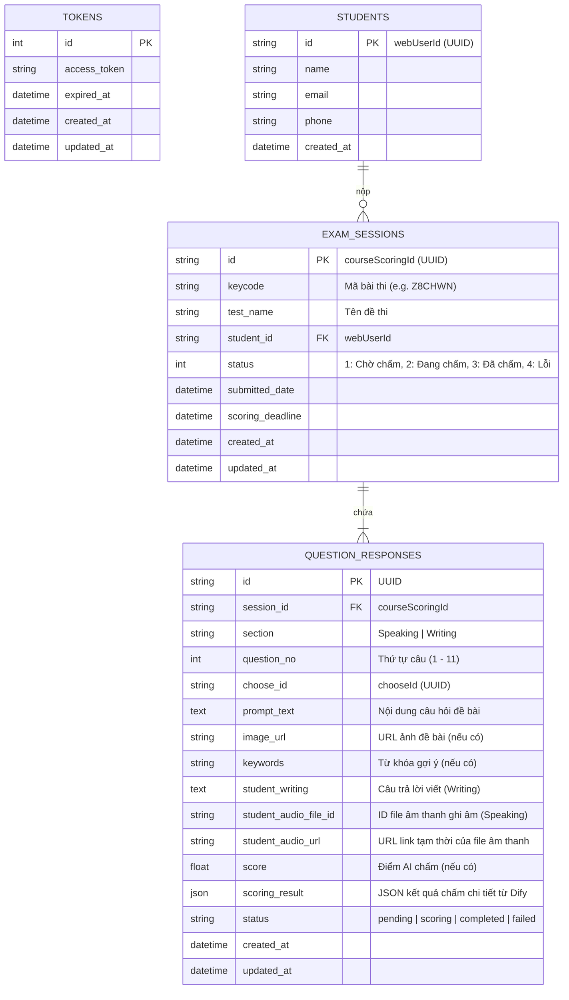

# Thiết kế Kiến trúc Cơ sở Dữ liệu (AI Scoring Admin DB Architecture)

Tài liệu này đặc tả kiến trúc cơ sở dữ liệu (Database Schema) cho hệ thống **AI Scoring Admin**, lưu trữ và quản lý thông tin token, học viên, bài làm của học viên và kết quả chấm điểm từ AI.

---

## 1. Mô hình Quan hệ Thực thể (Entity-Relationship Diagram)

---

## 2. Chi tiết Đặc tả các Bảng (Table Schema)

### 2.1. Bảng `tokens` (Lưu thông tin đăng nhập tập trung)
| Tên cột | Kiểu dữ liệu | Ràng buộc | Mô tả |
| :--- | :--- | :--- | :--- |
| `id` | `INT` | PK, Auto Increment | Khóa chính |
| `access_token` | `TEXT` | NOT NULL | Mã JWT token của Admin dùng để gọi API |
| `expired_at` | `DATETIME` | NOT NULL | Thời gian token hết hạn |
| `created_at` | `DATETIME` | Default CURRENT_TIMESTAMP | Thời gian sinh ra token |
| `updated_at` | `DATETIME` | On Update CURRENT_TIMESTAMP | Thời gian cập nhật token |

### 2.2. Bảng `students` (Thông tin học viên)
| Tên cột | Kiểu dữ liệu | Ràng buộc | Mô tả |
| :--- | :--- | :--- | :--- |
| `id` | `VARCHAR(36)` | PK | UUID của học viên (`webUserId` từ Elearning) |
| `name` | `VARCHAR(255)` | NOT NULL | Họ tên học viên |
| `email` | `VARCHAR(100)` | - | Email học viên |
| `phone` | `VARCHAR(20)` | - | Số điện thoại học viên |
| `created_at` | `DATETIME` | Default CURRENT_TIMESTAMP | Ngày tạo tài khoản học viên trong hệ thống |

### 2.3. Bảng `exam_sessions` (Các lượt làm bài thi của học viên)
| Tên cột | Kiểu dữ liệu | Ràng buộc | Mô tả |
| :--- | :--- | :--- | :--- |
| `id` | `VARCHAR(36)` | PK | UUID bài thi (`courseScoringId` từ Elearning) |
| `keycode` | `VARCHAR(20)` | Index, NOT NULL | Mã đề thi (Ví dụ: `Z8CHWN`) |
| `test_name` | `VARCHAR(255)` | NOT NULL | Tên đầy đủ của đề thi trên IIG |
| `student_id` | `VARCHAR(36)` | FK -> `students.id` | ID học viên tương ứng |
| `status` | `TINYINT` | NOT NULL, Default 1 | Trạng thái (1: Chờ chấm, 2: Đang chấm, 3: Đã chấm, 4: Lỗi) |
| `submitted_date` | `DATETIME` | - | Thời gian học viên nộp bài thi |
| `scoring_deadline` | `DATETIME` | - | Thời hạn cuối cần chấm điểm xong |
| `created_at` | `DATETIME` | Default CURRENT_TIMESTAMP | Thời gian ghi nhận vào hệ thống admin |
| `updated_at` | `DATETIME` | On Update CURRENT_TIMESTAMP | Thời gian cập nhật trạng thái |

### 2.4. Bảng `question_responses` (Chi tiết câu hỏi & Bài làm của từng câu)
| Tên cột | Kiểu dữ liệu | Ràng buộc | Mô tả |
| :--- | :--- | :--- | :--- |
| `id` | `VARCHAR(36)` | PK | UUID tự sinh của câu trả lời |
| `session_id` | `VARCHAR(36)` | FK -> `exam_sessions.id` | ID lượt thi |
| `section` | `VARCHAR(10)` | NOT NULL | Phần thi (`Speaking` hoặc `Writing`) |
| `question_no` | `INT` | NOT NULL | Số câu hỏi (Ví dụ: 1 đến 11) |
| `choose_id` | `VARCHAR(36)` | NOT NULL | `chooseId` dùng để gọi API chi tiết từ Elearning |
| `prompt_text` | `TEXT` | NOT NULL | Đoạn text đề bài (Đã làm sạch HTML) |
| `image_url` | `TEXT` | - | Link ảnh đề bài (nếu có) |
| `keywords` | `VARCHAR(255)` | - | Các từ khóa bắt buộc phải dùng (nếu có) |
| `student_writing` | `TEXT` | - | Câu trả lời dạng chữ của học viên (Writing) |
| `student_audio_file_id`| `VARCHAR(100)`| - | ID file ghi âm trên Elearning (Speaking) |
| `student_audio_url` | `TEXT` | - | URL tạm thời được giải mã của file âm thanh ghi âm |
| `score` | `FLOAT` | Default NULL | Điểm AI trả về |
| `scoring_result` | `JSON` | Default NULL | Kết quả JSON chi tiết (Nhận xét, phân tích lỗi) từ Dify |
| `status` | `VARCHAR(20)` | Default 'pending' | Trạng thái của riêng câu hỏi này |
| `created_at` | `DATETIME` | Default CURRENT_TIMESTAMP | Thời gian khởi tạo |
| `updated_at` | `DATETIME` | On Update CURRENT_TIMESTAMP | Thời gian chấm xong |

---

## 3. Lợi ích của Thiết kế này

1. **Chuẩn hóa dữ liệu cao (Normalized DB):** Tách biệt thông tin Học viên (`students`), Lượt thi thử (`exam_sessions`) và từng câu trả lời cụ thể (`question_responses`) giúp quản lý dữ liệu sạch sẽ, tránh dư thừa.
2. **Lịch sử và Trạng thái rõ ràng:** Có thể quản lý chính xác trạng thái chấm của cả bài thi hoặc trạng thái chi tiết của từng câu đơn lẻ (`pending`, `scoring`, `completed`, `failed`).
3. **Phục vụ phân tích dữ liệu:** Trường `scoring_result` lưu định dạng JSON thô từ Dify giúp lập báo cáo học tập, gợi ý lộ trình, thống kê các lỗi thường gặp một cách linh hoạt mà không cần thay đổi cấu trúc bảng sau này.
