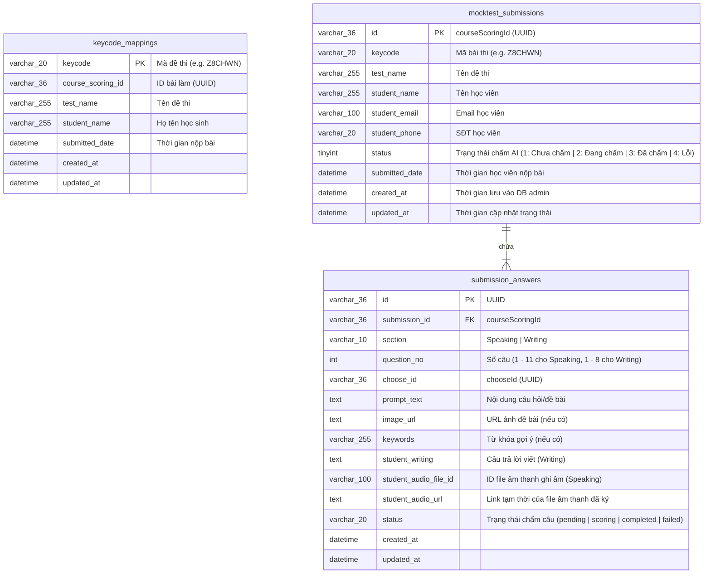

# Thiết kế Cơ sở Dữ liệu Lưu trữ Bài làm (AI Scoring Admin DB Schema - Giai đoạn 1)

Tài liệu này đặc tả cấu trúc cơ sở dữ liệu (Database Schema) giai đoạn 1, tập trung hoàn toàn vào việc lưu trữ thông tin lượt thi, đề bài và nội dung câu trả lời của học sinh ngay sau khi hệ thống bóc tách dữ liệu từ Elearning API về, trước khi tiến hành gửi chấm điểm.

---

## 1. Sơ đồ Thực thể Quan hệ (ERD - Giai đoạn 1)



---

## 2. Câu lệnh SQL khởi tạo (SQL Schema)

### 2.1. Bảng `keycode_mappings` (Bảng đệm ánh xạ nhanh Keycode -> ID bài làm)
Bảng này đóng vai trò bộ nhớ đệm (Cache). Khi hệ thống quét API với `PageSize: 1000`, toàn bộ danh sách cặp (Keycode, ID bài làm) sẽ được lưu/cập nhật vào bảng này để truy vấn tức thì mà không cần gọi lại Elearning API nhiều lần.

```sql
CREATE TABLE `keycode_mappings` (
  `keycode` VARCHAR(20) NOT NULL COMMENT 'Mã đề thi (ví dụ: Z8CHWN)',
  `course_scoring_id` VARCHAR(36) NOT NULL COMMENT 'ID bài làm (courseScoringId)',
  `test_name` VARCHAR(255) NOT NULL COMMENT 'Tên đề thi trên hệ thống',
  `student_name` VARCHAR(255) NOT NULL COMMENT 'Họ tên học sinh',
  `submitted_date` DATETIME NOT NULL COMMENT 'Thời gian nộp bài',
  `created_at` DATETIME NOT NULL DEFAULT CURRENT_TIMESTAMP,
  `updated_at` DATETIME NOT NULL DEFAULT CURRENT_TIMESTAMP ON UPDATE CURRENT_TIMESTAMP,
  PRIMARY KEY (`keycode`),
  KEY `idx_course_scoring_id` (`course_scoring_id`)
) ENGINE=InnoDB DEFAULT CHARSET=utf8mb4 COLLATE=utf8mb4_unicode_ci;
```

### 2.2. Bảng `mocktest_submissions` (Lưu lượt thi và trạng thái chấm của AI)
Bảng này ghi nhận thông tin học viên, mã đề và thời gian nộp bài từ Elearning API. Trạng thái mặc định khi mới đồng bộ về là `1` (Chưa chấm).

```sql
CREATE TABLE `mocktest_submissions` (
  `id` VARCHAR(36) NOT NULL COMMENT 'courseScoringId từ Elearning (UUID)',
  `keycode` VARCHAR(20) NOT NULL COMMENT 'Mã đề thi (ví dụ: Z8CHWN)',
  `test_name` VARCHAR(255) NOT NULL COMMENT 'Tên đề thi trên hệ thống',
  `student_name` VARCHAR(255) NOT NULL COMMENT 'Họ tên học viên',
  `student_email` VARCHAR(100) DEFAULT NULL COMMENT 'Email học viên',
  `student_phone` VARCHAR(20) DEFAULT NULL COMMENT 'Số điện thoại học viên',
  `status` TINYINT NOT NULL DEFAULT 1 COMMENT 'Trạng thái chấm AI: 1: Chưa chấm, 2: Đang chấm, 3: Đã chấm, 4: Lỗi',
  `submitted_date` DATETIME NOT NULL COMMENT 'Thời gian học viên nộp bài thi',
  `created_at` DATETIME NOT NULL DEFAULT CURRENT_TIMESTAMP COMMENT 'Ngày đồng bộ về DB Admin',
  `updated_at` DATETIME NOT NULL DEFAULT CURRENT_TIMESTAMP ON UPDATE CURRENT_TIMESTAMP,
  PRIMARY KEY (`id`),
  KEY `idx_keycode` (`keycode`),
  KEY `idx_status` (`status`)
) ENGINE=InnoDB DEFAULT CHARSET=utf8mb4 COLLATE=utf8mb4_unicode_ci;
```

### 2.2. Bảng `submission_answers` (Lưu nội dung bài làm thô phục vụ chấm bài)
Bảng này lưu trữ toàn bộ đề bài, từ khóa, ảnh và câu trả lời thô của học sinh cho từng câu hỏi (Speaking/Writing) của lượt thi tương ứng.

```sql
CREATE TABLE `submission_answers` (
  `id` VARCHAR(36) NOT NULL COMMENT 'Khóa chính tự sinh (UUID)',
  `submission_id` VARCHAR(36) NOT NULL COMMENT 'FK liên kết tới mocktest_submissions.id',
  `section` VARCHAR(10) NOT NULL COMMENT 'Phần thi: Speaking hoặc Writing',
  `question_no` INT NOT NULL COMMENT 'Thứ tự câu hỏi trong đề thi',
  `choose_id` VARCHAR(36) NOT NULL COMMENT 'chooseId để lấy chi tiết câu hỏi',
  `prompt_text` TEXT NOT NULL COMMENT 'Đề bài (đã làm sạch HTML)',
  `image_url` TEXT DEFAULT NULL COMMENT 'Link ảnh đề bài (nếu có)',
  `keywords` VARCHAR(255) DEFAULT NULL COMMENT 'Từ khóa gợi ý cho Writing Q1-5',
  `student_writing` TEXT DEFAULT NULL COMMENT 'Bài viết học sinh nhập (Writing)',
  `student_audio_file_id` VARCHAR(100) DEFAULT NULL COMMENT 'ID file âm thanh ghi âm (Speaking)',
  `student_audio_url` TEXT DEFAULT NULL COMMENT 'Link tạm thời để nghe audio',
  `status` VARCHAR(20) NOT NULL DEFAULT 'pending' COMMENT 'Trạng thái chấm câu: pending (chưa chấm), scoring (đang chấm), completed (chấm xong), failed (lỗi)',
  `created_at` DATETIME NOT NULL DEFAULT CURRENT_TIMESTAMP,
  `updated_at` DATETIME NOT NULL DEFAULT CURRENT_TIMESTAMP ON UPDATE CURRENT_TIMESTAMP,
  PRIMARY KEY (`id`),
  UNIQUE KEY `idx_submission_q` (`submission_id`, `section`, `question_no`),
  FOREIGN KEY (`submission_id`) REFERENCES `mocktest_submissions`(`id`) ON DELETE CASCADE
) ENGINE=InnoDB DEFAULT CHARSET=utf8mb4 COLLATE=utf8mb4_unicode_ci;
```

---

## 3. Luồng hoạt động của Cơ sở dữ liệu giai đoạn 1

1. **Nhập Keycode:** Người dùng nhập mã đề (ví dụ: `Z8CHWN`).
2. **Gọi API & Đồng bộ:** 
   * Hệ thống gọi API Scoring của Elearning để tìm `courseScoringId` và thông tin lượt thi $\rightarrow$ Chèn 1 dòng mới vào `mocktest_submissions` với trạng thái `status = 1` (Chưa chấm).
   * Hệ thống gọi tiếp Detail API của Elearning để bóc tách 19 câu hỏi $\rightarrow$ Chèn 19 dòng tương ứng vào `submission_answers` với nội dung đề bài, câu trả lời học viên thu được, và gán trạng thái từng câu là `status = 'pending'`.
3. **Sẵn sàng chấm:** Dữ liệu lúc này đã sẵn sàng nằm trong DB cục bộ của bạn, phục vụ cho việc hiển thị lên giao diện danh sách chờ chấm hoặc kích hoạt các tiến trình chạy chấm điểm tự động tiếp theo.
