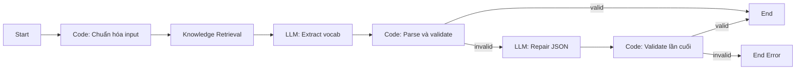

# Hướng dẫn xây dựng Dify Workflow — TOEIC Key Vocabulary

## 1. Mục tiêu

Workflow nhận một đoạn văn TOEIC, sử dụng Knowledge Base và LLM để trích xuất từ 8 đến 15 từ/cụm từ có giá trị cho học viên TOEIC 650+, sau đó trả về JSON tối giản để backend kiểm tra và lưu PostgreSQL.

Đầu vào:

```json
{
  "reading_content": "The company will reimburse employees for approved travel expenses."
}
```

Đầu ra duy nhất:

```json
{
  "w": [
    {
      "t": "reimburse",
      "p": "Verb",
      "i": "/ˌriːɪmˈbɜːs/",
      "m": "hoàn trả chi phí"
    }
  ]
}
```

Ý nghĩa các trường:

| Trường | Bắt buộc | Ý nghĩa |
|---|---:|---|
| `t` | Có | Từ/cụm từ ở dạng từ điển |
| `p` | Có | Loại từ đúng theo danh mục hệ thống |
| `i` | Có | Phiên âm IPA Anh-Anh, đặt trong `/.../` |
| `m` | Có | Nghĩa tiếng Việt ngắn gọn theo ngữ cảnh |

Không trả về vị trí trong passage, pillar P1–P4, lý do chọn, confidence, giải thích hoặc dữ liệu debug.

## 2. Kiến trúc



Backend chịu trách nhiệm gọi workflow, cache theo nội dung passage, kiểm tra lần cuối và lưu database. Dify không kết nối hoặc ghi trực tiếp vào database.

## 3. Chuẩn bị Knowledge Base

Sử dụng file:

`docs/KB_TOEIC_KEY_VOCABULARY.md`

Thiết lập chi tiết nằm trong mục 4 của tài liệu này. Sau khi upload, chạy thử các truy vấn như:

- `Rules for excluding elementary vocabulary and proper nouns`
- `How to choose a phrase instead of a single word`
- `Allowed part-of-speech values`
- `TOEIC finance vocabulary selection rules`

Kết quả truy xuất phải chứa đúng section liên quan. Nếu không, điều chỉnh chunk separator hoặc giảm chunk size trước khi xây workflow.

## 4. Cấu hình Knowledge Base trên Dify

Tên dataset đề xuất:

```text
TOEIC Key Vocabulary Rules
```

Mô tả:

```text
Quy tắc chọn Key Vocabulary TOEIC 650+, loại trừ từ cơ bản/tên riêng,
phân biệt single word và phrase, chuẩn hóa base form, POS, IPA và nghĩa Việt.
```

### 4.1 Indexing technique

Chọn:

```text
High Quality
```

Không chọn Economy vì rule retrieval cần độ chính xác cao.

### 4.2 Chunk structure

Ưu tiên `General` hoặc chế độ chunk thông thường. File KB đã được chia bằng heading Markdown rõ ràng.

Thiết lập đề xuất:

| Setting | Giá trị đề xuất |
|---|---|
| Chunk mode | General |
| Chunk size | 800–1.200 tokens |
| Chunk overlap | 100–150 tokens hoặc khoảng 10–15% |
| Separator | Tách theo Markdown heading nếu phiên bản Dify hỗ trợ; nếu không dùng `\n## ` |
| Text preprocessing | Xóa khoảng trắng liên tiếp; giữ heading và bảng |
| Remove URL/email | Tắt |

Mục tiêu là giữ mỗi nhóm rule trong một hoặc vài chunk có ngữ nghĩa hoàn chỉnh. Không đặt chunk quá nhỏ khiến bảng rule bị tách khỏi phần giải thích.

### 4.3 Embedding model

Chọn embedding model đa ngôn ngữ có khả năng xử lý tốt cả tiếng Anh và tiếng Việt. Ưu tiên model embedding đang được tổ chức sử dụng ổn định; không đổi model sau khi dataset đã production nếu chưa re-index toàn bộ.

Nếu có lựa chọn rerank model, bật rerank vì các section trong KB có nhiều thuật ngữ gần nhau.

### 4.4 Retrieval settings

Trong node Knowledge Retrieval:

| Setting | Giá trị khởi đầu |
|---|---|
| Retrieval method | Hybrid Search |
| Top K | 6 |
| Score threshold | 0.35 |
| Rerank | Bật nếu có model |
| Rerank Top K | 6 |

Sau khi test, có thể điều chỉnh:

- Thiếu exclusion/base-form rule: tăng Top K lên 8.
- Context quá dài hoặc LLM bị nhiễu: giảm Top K xuống 4–5.
- Không lấy được chunk đúng: giảm score threshold xuống 0.25–0.30.
- Lấy nhiều chunk không liên quan: tăng threshold lên 0.40–0.50.

### 4.5 Retrieval query

Không dùng nguyên passage làm query duy nhất. Trong node Knowledge Retrieval, dùng một query có cả yêu cầu nghiệp vụ và passage:

```text
Retrieve TOEIC 650+ key vocabulary extraction rules, exclusions,
single-word versus phrase rules, base-form rules, allowed POS values,
IPA and Vietnamese meaning requirements relevant to this passage:

{{ normalized_passage }}
```

Các rule cứng như JSON schema, số lượng và danh sách POS vẫn phải viết trực tiếp trong prompt. Knowledge retrieval chỉ bổ sung kiến thức chọn từ.

## 5. Tạo Workflow App

Trong Dify chọn:

```text
Studio → Create App → Workflow
```

Tên đề xuất:

```text
TOEIC Key Vocabulary Extraction
```

Workflow API sẽ được backend gọi qua:

```http
POST /v1/workflows/run
```

Sử dụng `response_mode: blocking` cho MVP. Nếu passage rất dài hoặc cần xử lý hàng loạt, chuyển sang queue/async ở backend.

## 6. Node 1 — Start

Tạo input:

| Variable | Type | Required | Giới hạn đề xuất |
|---|---|---:|---:|
| `reading_content` | Paragraph | Có | 20.000 ký tự |

Không nhận POS list hoặc quantity từ client để tránh người gọi thay đổi rule nghiệp vụ.

## 7. Node 2 — Code: Normalize Input

Tên node:

```text
Normalize Passage
```

Input mapping:

```text
reading_content = {{ Start.reading_content }}
```

JavaScript:

```javascript
function main({ reading_content }) {
  const normalized = String(reading_content || '')
    .replace(/\r\n/g, '\n')
    .replace(/[ \t]+/g, ' ')
    .replace(/\n{3,}/g, '\n\n')
    .trim();

  if (!normalized) {
    throw new Error('reading_content is required');
  }

  const wordCount = normalized
    .split(/\s+/)
    .filter(Boolean)
    .length;

  return {
    normalized_passage: normalized,
    word_count: wordCount
  };
}
```

Output variables:

- `normalized_passage`: String
- `word_count`: Number

## 8. Node 3 — Knowledge Retrieval

Tên node:

```text
Retrieve Vocabulary Rules
```

Dataset: `TOEIC Key Vocabulary Rules`.

Query:

```text
Retrieve TOEIC 650+ vocabulary extraction rules, exclusions,
single-word versus phrase decision rules, base-form requirements,
allowed system POS, IPA and Vietnamese meaning requirements for:

{{ Normalize Passage.normalized_passage }}
```

Áp dụng các settings tại mục 4.4.

## 9. Node 4 — LLM: Extract Vocabulary

Tên node:

```text
Extract Key Vocabulary
```

### 9.1 Model settings

| Setting | Giá trị đề xuất |
|---|---|
| Model | Model có structured output và xử lý Anh–Việt tốt |
| Temperature | 0 hoặc thấp nhất có thể |
| Top P | 0.1–0.3 nếu bắt buộc cấu hình |
| Max output tokens | 2.000 |
| Response format | JSON/Structured Output nếu model hỗ trợ |
| Frequency penalty | 0 |
| Presence penalty | 0 |

Giữ cố định model/version trong production. Temperature 0 không tự bảo đảm kết quả giống tuyệt đối; backend vẫn phải cache theo passage.

### 9.2 Context variables

- `context`: output của Knowledge Retrieval.
- `reading_content`: `Normalize Passage.normalized_passage`.

### 9.3 Prompt

```text
# ROLE
You are a Senior TOEIC Linguistic Specialist at IIG eLearning.

# KNOWLEDGE CONTEXT
{{#context#}}

# INPUT PASSAGE
{{#Normalize_Passage.normalized_passage#}}

# TASK
Extract the most valuable TOEIC 650+ vocabulary from the input passage.

# RULES
1. Return exactly 8 to 15 items. Prefer quality over the maximum quantity.
2. Every item must be grounded in the input passage. Never invent related words.
3. Select high-value B1-C1 professional and TOEIC vocabulary.
4. Apply the Business Functional Test and Four Pillars from the Knowledge Context internally.
5. Aim for approximately 80% single words and 20% phrases.
6. Exclude proper nouns, A1/A2 words, overly basic business words, duplicates and subsumed words.
7. Return dictionary/base forms. Return verbs in infinitive form without "to".
8. The "p" field must be exactly one of these system values:
   Noun, Verb, Adjective, Adverb, Noun Phrase, Phrasal Verb,
   Adjective Phrase, Idiom, Verb Phrase, Preposition,
   Prepositional Phrase, Prefix, Suffix, Conjunction,
   Interjection, Phrase.
9. Use the most specific applicable system type.
10. Return British English IPA enclosed in forward slashes.
11. Return a concise Vietnamese meaning matching the passage context.
12. Do not return evidence, source position, pillar, reason, confidence,
    notes, explanations or debug fields.

# OUTPUT
Return valid JSON only with exactly this structure:
{"w":[{"t":"word or phrase","p":"system POS value","i":"/IPA/","m":"nghĩa tiếng Việt"}]}

# STRICT VALIDATION
- Output JSON only. No Markdown or code fences.
- Only use the fields t, p, i and m in each item.
- Do not return null or empty values.
- Do not create any POS outside the supplied system list.
- Silently verify count, grounding, POS, IPA, duplicates and ratio before returning.
```

Nếu Dify dùng cú pháp variable khác, chọn biến trực tiếp từ Variable Picker thay vì tự gõ placeholder.

### 9.4 Structured output schema

Nếu model/node hỗ trợ JSON Schema, cấu hình:

```json
{
  "type": "object",
  "additionalProperties": false,
  "required": ["w"],
  "properties": {
    "w": {
      "type": "array",
      "minItems": 8,
      "maxItems": 15,
      "items": {
        "type": "object",
        "additionalProperties": false,
        "required": ["t", "p", "i", "m"],
        "properties": {
          "t": { "type": "string", "minLength": 1 },
          "p": {
            "type": "string",
            "enum": [
              "Noun", "Verb", "Adjective", "Adverb", "Noun Phrase",
              "Phrasal Verb", "Adjective Phrase", "Idiom", "Verb Phrase",
              "Preposition", "Prepositional Phrase", "Prefix", "Suffix",
              "Conjunction", "Interjection", "Phrase"
            ]
          },
          "i": { "type": "string", "minLength": 3 },
          "m": { "type": "string", "minLength": 1 }
        }
      }
    }
  }
}
```

## 10. Node 5 — Code: Parse và Validate

Tên node:

```text
Validate Extraction
```

Input `raw_output` là text/structured output của LLM.

```javascript
function main({ raw_output }) {
  const allowedTypes = new Set([
    'Noun', 'Verb', 'Adjective', 'Adverb', 'Noun Phrase',
    'Phrasal Verb', 'Adjective Phrase', 'Idiom', 'Verb Phrase',
    'Preposition', 'Prepositional Phrase', 'Prefix', 'Suffix',
    'Conjunction', 'Interjection', 'Phrase'
  ]);

  const errors = [];
  let data;

  try {
    data = typeof raw_output === 'string'
      ? JSON.parse(raw_output.replace(/^```json\s*|\s*```$/g, '').trim())
      : raw_output;
  } catch (error) {
    return {
      valid: false,
      errors: ['Output is not valid JSON'],
      normalized_json: ''
    };
  }

  if (!data || !Array.isArray(data.w)) {
    errors.push('w must be an array');
  } else {
    if (data.w.length < 8 || data.w.length > 15) {
      errors.push('w must contain between 8 and 15 items');
    }

    const seen = new Set();

    data.w.forEach((item, index) => {
      const prefix = `w[${index}]`;

      if (!item || typeof item !== 'object' || Array.isArray(item)) {
        errors.push(`${prefix} must be an object`);
        return;
      }

      const keys = Object.keys(item);
      const unsupported = keys.filter(key => !['t', 'p', 'i', 'm'].includes(key));
      if (unsupported.length) {
        errors.push(`${prefix} has unsupported fields: ${unsupported.join(', ')}`);
      }

      for (const field of ['t', 'p', 'i', 'm']) {
        if (typeof item[field] !== 'string' || !item[field].trim()) {
          errors.push(`${prefix}.${field} must be a non-empty string`);
        }
      }

      if (typeof item.p === 'string' && !allowedTypes.has(item.p.trim())) {
        errors.push(`${prefix}.p is not an allowed system value`);
      }

      if (typeof item.i === 'string' && !/^\/.+\/$/.test(item.i.trim())) {
        errors.push(`${prefix}.i must be IPA enclosed in forward slashes`);
      }

      if (typeof item.t === 'string' && typeof item.p === 'string') {
        const key = `${item.t.trim().toLowerCase()}|${item.p.trim().toLowerCase()}`;
        if (seen.has(key)) errors.push(`${prefix} is duplicated`);
        seen.add(key);
      }
    });
  }

  return {
    valid: errors.length === 0,
    errors,
    normalized_json: errors.length ? '' : JSON.stringify(data)
  };
}
```

Lưu ý: validator cấu trúc không xác minh đầy đủ IPA hoặc semantic grounding. Backend và QA vẫn cần test bằng bộ passage mẫu.

## 11. Node 6 — If/Else

Điều kiện:

```text
Validate Extraction.valid equals true
```

- True → End Success.
- False → Repair Output.

## 12. Node 7 — LLM: Repair Output

Tên node:

```text
Repair Invalid Output
```

Dùng cùng model và settings như extraction. Không cần gọi Knowledge Retrieval lần nữa.

Prompt:

```text
Repair the JSON vocabulary output so it satisfies all validation errors.

INPUT PASSAGE:
{{ Normalize Passage.normalized_passage }}

ALLOWED POS:
Noun, Verb, Adjective, Adverb, Noun Phrase, Phrasal Verb,
Adjective Phrase, Idiom, Verb Phrase, Preposition,
Prepositional Phrase, Prefix, Suffix, Conjunction,
Interjection, Phrase.

INVALID OUTPUT:
{{ Extract Key Vocabulary.output }}

VALIDATION ERRORS:
{{ Validate Extraction.errors }}

Return JSON only:
{"w":[{"t":"word or phrase","p":"system POS value","i":"/IPA/","m":"nghĩa tiếng Việt"}]}

Keep valid items where possible. Return 8 to 15 grounded items. Use only t, p, i and m.
```

Chỉ repair một lần. Sau đó chạy validator lần cuối. Nếu vẫn sai, workflow trả lỗi để backend ghi nhận; không tạo vòng lặp vô hạn.

## 13. Node 8 — End

### End Success

Output variable:

```text
result = {{ validator_success.normalized_json }}
```

Nếu Dify cho phép trả object thay vì string, ưu tiên object. Backend phải hỗ trợ cả hai dạng vì một số phiên bản Dify đặt output trong `data.outputs.result` dưới dạng chuỗi JSON.

### End Error

Output:

```json
{
  "error_code": "INVALID_VOCAB_OUTPUT",
  "message": "Dify could not produce a valid vocabulary result after one repair attempt."
}
```

Không lưu danh sách vocab khi workflow kết thúc ở nhánh lỗi.

## 14. Cấu hình API và backend

Request từ backend:

```json
{
  "inputs": {
    "reading_content": "The company will reimburse employees..."
  },
  "response_mode": "blocking",
  "user": "admin-user-id"
}
```

Headers:

```http
Authorization: Bearer <DIFY_WORKFLOW_API_KEY>
Content-Type: application/json
```

Không gửi API key từ frontend. API key chỉ nằm trong environment variable hoặc bảng cấu hình đã mã hóa/giới hạn quyền đọc.

Environment variables đề xuất:

```env
KEY_VOCAB_DIFY_API_URL=https://your-dify-host/v1
KEY_VOCAB_DIFY_API_KEY=app-xxxxxxxx
KEY_VOCAB_RULE_VERSION=toeic-key-vocab-v1.0
```

Timeout đề xuất: 60–90 giây cho blocking request. Có retry tối đa một lần đối với timeout, HTTP 429 hoặc 5xx; không retry với lỗi schema/validation.

## 15. Tính nhất quán

Cùng một passage có thể vẫn cho kết quả khác nếu gọi LLM nhiều lần, kể cả temperature 0. Backend cần:

1. Chuẩn hóa passage giống node Normalize.
2. Tính `SHA-256(normalized_passage)`.
3. Tìm kết quả `completed` theo `input_hash + rule_version`.
4. Nếu đã có, trả kết quả cũ và không gọi lại Dify.
5. Khi KB, prompt hoặc rule thay đổi, tăng `rule_version`.

Không dùng `force_regenerate` trong luồng người dùng thông thường. Chỉ admin có quyền mới được tạo revision mới.

## 16. Cấu trúc database đề xuất

### 16.1 Bảng lần trích xuất

```sql
CREATE TABLE vocab_extraction_runs (
  id UUID PRIMARY KEY DEFAULT gen_random_uuid(),
  passage TEXT NOT NULL,
  normalized_passage TEXT NOT NULL,
  input_hash VARCHAR(64) NOT NULL,
  status VARCHAR(20) NOT NULL
    CHECK (status IN ('processing', 'completed', 'failed')),
  rule_version VARCHAR(50) NOT NULL,
  dify_workflow_run_id VARCHAR(255),
  raw_response JSONB,
  error_message TEXT,
  created_by UUID REFERENCES users(id),
  created_at TIMESTAMP NOT NULL DEFAULT CURRENT_TIMESTAMP,
  completed_at TIMESTAMP,
  updated_at TIMESTAMP NOT NULL DEFAULT CURRENT_TIMESTAMP,
  UNIQUE (input_hash, rule_version)
);
```

### 16.2 Bảng vocab của passage

Nếu hệ thống đã có bảng vocabulary tương ứng màn hình hiện tại, dùng khóa ngoại tới bảng đó. Nếu chưa có, cấu trúc tối thiểu:

```sql
CREATE TABLE vocab_extraction_items (
  id UUID PRIMARY KEY DEFAULT gen_random_uuid(),
  extraction_run_id UUID NOT NULL
    REFERENCES vocab_extraction_runs(id) ON DELETE CASCADE,
  vocabulary_text TEXT NOT NULL,
  vocabulary_type VARCHAR(30) NOT NULL,
  pronunciation TEXT NOT NULL,
  meaning_vi TEXT NOT NULL,
  display_order SMALLINT NOT NULL,
  created_at TIMESTAMP NOT NULL DEFAULT CURRENT_TIMESTAMP,
  UNIQUE (extraction_run_id, display_order),
  UNIQUE (extraction_run_id, vocabulary_text, vocabulary_type)
);
```

Giá trị `vocabulary_type` phải tồn tại trong danh mục loại từ nghiệp vụ của hệ thống. Nên dùng foreign key tới bảng danh mục nếu hệ thống đã có bảng này, thay vì tạo một enum PostgreSQL mới.

## 17. Trình tự lưu dữ liệu

1. Backend nhận `reading_content` và kiểm tra độ dài.
2. Chuẩn hóa, tính hash và kiểm tra cache.
3. Tạo run `processing`.
4. Gọi Dify.
5. Parse `data.outputs.result`.
6. Chạy validator backend với cùng whitelist POS.
7. Trong transaction, insert/upsert từng vocab và liên kết với run.
8. Cập nhật run thành `completed`, lưu raw response để audit kỹ thuật.
9. Nếu lỗi, rollback danh sách item và cập nhật run thành `failed`.

Raw response chỉ dùng cho vận hành/debug, không phải JSON trả về frontend.

## 18. Checklist test trước production

Chuẩn bị ít nhất 30 passage, bao phủ:

- Ngắn, trung bình và dài.
- HR, Finance, Real Estate, Manufacturing, IT, Marketing, Purchasing, Healthcare, Banking, Tourism.
- Nhiều proper nouns.
- Passage có ít hơn 8 candidate chất lượng.
- Cùng một từ ở dạng số nhiều/quá khứ/V-ing.
- Phrase chứa một candidate single word.
- Từ có thể mang nhiều POS.

Với mỗi case kiểm tra:

- JSON parse được.
- Có 8–15 items.
- Chỉ có `t`, `p`, `i`, `m`.
- POS đúng tuyệt đối theo danh mục hệ thống.
- Không có proper nouns hoặc từ A1/A2 bị cấm.
- Không hallucinate từ ngoài passage.
- Base form đúng.
- IPA đúng định dạng và tương đối chính xác.
- Nghĩa Việt phù hợp ngữ cảnh.
- Tỷ lệ single word/phrase xấp xỉ 80/20.
- Gọi lần hai trả dữ liệu cache giống lần đầu.

## 19. Monitoring

Theo dõi các chỉ số:

- Tỷ lệ workflow thành công.
- Tỷ lệ phải chạy repair.
- Tỷ lệ validator backend từ chối.
- Thời gian đáp ứng p50/p95.
- Chi phí token trung bình mỗi passage.
- Tỷ lệ admin chỉnh sửa vocab sau khi sinh.

Nếu repair vượt 10–15%, cần sửa prompt hoặc structured schema. Nếu admin thường xuyên sửa cùng một loại lỗi, cập nhật KB, tăng `rule_version`, re-index và chạy lại bộ test chuẩn.

