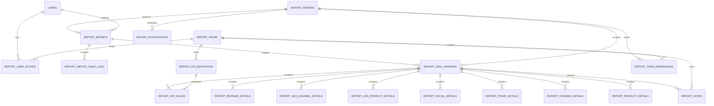

# Kiến trúc Database cho hệ thống Báo cáo DVS

## 1. Mục tiêu và phạm vi

Thiết kế này chuyển dữ liệu từ hai nguồn hiện tại vào PostgreSQL của IIG Admin:

- File báo cáo tháng `Jun_Monthly Report.xlsm` gồm KPI tổng hợp, dữ liệu chi tiết của 6 mảng và nhận xét.
- File dữ liệu năm `DB_KPI_DVS_2026 (1).xlsx` gồm KPI summary, các bảng detail, report note, cấu hình KPI, user, file tháng và sync log.

Thiết kế phải phục vụ đồng thời:

1. Phase 1: upload Excel, kiểm tra, preview, xác nhận và hiển thị dashboard.
2. Phase 2: nhập liệu trực tiếp trên IIG Admin, duyệt/khóa kỳ và cập nhật dashboard sau khi lưu.
3. Giữ lịch sử import/chỉnh sửa, hỗ trợ rollback và không làm mất dữ liệu kỳ cũ khi upload lại.

## 2. Nguyên tắc thiết kế

1. PostgreSQL là nguồn dữ liệu duy nhất của dashboard sau khi migrate.
2. `98_DATA_EXPORT` là import contract cho KPI trong Phase 1.
3. KPI tổng hợp dùng một fact table chung; detail của từng team dùng bảng typed riêng vì cấu trúc và nghiệp vụ khác nhau.
4. Không lưu các số chính dưới dạng chuỗi định dạng Excel. Tiền, số lượng và tỷ lệ dùng `NUMERIC`.
5. Không lưu `Quý`, `% HT KH`, `% vs tháng trước` như nguồn sự thật nếu có thể tính lại. Dashboard tính từ kỳ và các giá trị gốc.
6. Mọi import phải chạy trong một transaction: toàn bộ bảng thành công hoặc rollback toàn bộ.
7. Upload lại không xóa lịch sử. Dữ liệu cũ được đánh dấu superseded; một kỳ chỉ có một version published hiện hành.
8. User và role dùng bảng `users`/`roles` hiện có của IIG Admin; không tạo bản sao từ sheet `12_USERS`.
9. Phase 1 và Phase 2 ghi vào cùng data model. Cột `source_type` phân biệt `excel_import`, `manual_entry`, `system_calculated`.

## 3. Mô hình quan hệ tổng thể



## 4. Nhóm bảng nền tảng

### 4.1 `report_teams`

Thay cho danh mục `Team_Code` trong `99_LISTS`.

| Cột | Kiểu | Ràng buộc / ý nghĩa |
| --- | --- | --- |
| `id` | UUID | PK |
| `code` | VARCHAR(20) | UNIQUE: `REV`, `ADS`, `COM`, `TRADE`, `TRAIN`, `PROD` |
| `name` | VARCHAR(120) | Tên hiển thị |
| `display_order` | SMALLINT | Thứ tự dashboard |
| `is_active` | BOOLEAN | Cho phép sử dụng |
| `created_at`, `updated_at` | TIMESTAMPTZ | Audit timestamps |

### 4.2 `report_periods`

Thay cho `13_CONFIG_FILES` và thông tin kỳ tại `01_Tong_hop`.

| Cột | Kiểu | Ràng buộc / ý nghĩa |
| --- | --- | --- |
| `id` | UUID | PK |
| `year` | SMALLINT | CHECK 2000–2100 |
| `month` | SMALLINT | CHECK 1–12 |
| `status` | VARCHAR(20) | `draft`, `open`, `submitted`, `approved`, `locked`, `reopened` |
| `submission_deadline` | TIMESTAMPTZ | Hạn chốt |
| `current_version_id` | UUID nullable | Version đang hiển thị; phải thuộc chính kỳ này |
| `approved_by` | UUID nullable | FK `users.id` |
| `approved_at`, `locked_at` | TIMESTAMPTZ nullable | Trạng thái kỳ |
| `created_by` | UUID | FK `users.id` |
| `created_at`, `updated_at` | TIMESTAMPTZ | Audit timestamps |

Ràng buộc: `UNIQUE (year, month)`.

Không cần lưu quý; truy vấn bằng `CEIL(month / 3.0)` hoặc tạo generated expression/view.

### 4.3 `report_kpi_definitions`

Thay cho `14_CONFIG_KPI`, đồng thời bổ sung quy tắc tổng hợp quý/năm.

| Cột | Kiểu | Ý nghĩa |
| --- | --- | --- |
| `id` | UUID | PK |
| `team_id` | UUID | FK `report_teams.id` |
| `code` | VARCHAR(40) | Mã KPI cố định, UNIQUE |
| `name` | VARCHAR(255) | Tên KPI |
| `unit` | VARCHAR(50) | Đồng, %, lượt, người… |
| `evaluation_direction` | VARCHAR(20) | `increase_good`, `decrease_good`, `monitor` |
| `aggregation_method` | VARCHAR(30) | Xem mục 9 |
| `aggregation_config` | JSONB | Tử số/mẫu số hoặc weight KPI nếu cần |
| `frequency` | VARCHAR(20) | Mặc định `monthly` |
| `source_sheet` | VARCHAR(100) | Sheet Excel tham chiếu |
| `source_key` | VARCHAR(100) | Mapping/version template |
| `display_order` | SMALLINT | Thứ tự trong team |
| `is_active` | BOOLEAN | Trạng thái |
| `notes` | TEXT | Ghi chú cấu hình |
| `created_at`, `updated_at` | TIMESTAMPTZ | Audit timestamps |

### 4.4 `report_user_scopes`

Thay cho `Team_Code` và `Data_Scope` ở `12_USERS`, nhưng vẫn dùng permission trong `roles`.

| Cột | Kiểu | Ý nghĩa |
| --- | --- | --- |
| `user_id` | UUID | FK `users.id` |
| `team_id` | UUID nullable | NULL khi scope toàn bộ |
| `scope` | VARCHAR(20) | `all`, `team`, `assigned` |
| `valid_from`, `valid_to` | DATE nullable | Hiệu lực |
| `created_by` | UUID | FK `users.id` |

Nên dùng `id UUID` làm PK. Tạo partial unique index `(user_id, scope) WHERE team_id IS NULL` và unique `(user_id, team_id, scope) WHERE team_id IS NOT NULL`; CHECK bảo đảm `scope='all'` thì `team_id IS NULL`.

## 5. Import, version và audit

### 5.1 `report_imports`

Một dòng cho mỗi file upload/phiên import.

| Cột | Kiểu | Ý nghĩa |
| --- | --- | --- |
| `id` | UUID | PK |
| `period_id` | UUID | Kỳ người dùng chọn |
| `uploaded_by` | UUID | FK `users.id` |
| `original_file_name` | VARCHAR(255) | Tên file |
| `storage_key` | TEXT | Path object storage, không lưu binary trong DB |
| `mime_type` | VARCHAR(100) | MIME thực tế |
| `file_size_bytes` | BIGINT | CHECK > 0 |
| `sha256` | CHAR(64) | Phát hiện trùng file |
| `template_version` | VARCHAR(30) | Phiên bản mẫu Excel |
| `file_year`, `file_month` | SMALLINT nullable | Kỳ đọc được trong file |
| `status` | VARCHAR(30) | `uploaded`, `inspecting`, `ready`, `committing`, `committed`, `rejected`, `failed`, `cancelled` |
| `warnings` | JSONB | Warning có cấu trúc |
| `error_summary` | JSONB | Lỗi validation/import |
| `started_at`, `inspected_at`, `committed_at` | TIMESTAMPTZ | Timeline |
| `created_at`, `updated_at` | TIMESTAMPTZ | Audit timestamps |

Index: `(period_id, created_at DESC)`, `(uploaded_by, created_at DESC)`, `sha256`.

### 5.2 `report_import_table_logs`

Thay cho `11_SYNC_LOG`, một dòng cho từng bảng đích của import.

Các cột chính: `import_id`, `source_sheet`, `target_table`, `rows_read`, `rows_valid`, `rows_inserted`, `rows_updated`, `rows_skipped`, `rows_rejected`, `status`, `error_details JSONB`, `started_at`, `completed_at`.

### 5.3 `report_data_versions`

Tách version khỏi file upload để Phase 2 cũng tạo version mà không có Excel.

| Cột | Kiểu | Ý nghĩa |
| --- | --- | --- |
| `id` | UUID | PK |
| `period_id` | UUID | FK kỳ |
| `version_no` | INTEGER | Tăng tuần tự trong kỳ |
| `source_type` | VARCHAR(30) | `excel_import`, `manual_entry`, `migration` |
| `import_id` | UUID nullable | FK import |
| `status` | VARCHAR(20) | `draft`, `published`, `superseded`, `rejected` |
| `created_by`, `published_by` | UUID | FK users |
| `created_at`, `published_at` | TIMESTAMPTZ | Audit |

Ràng buộc:

- `UNIQUE (period_id, version_no)`.
- Partial unique index bảo đảm tối đa một version `published` cho mỗi kỳ.
- `report_periods.current_version_id` trỏ tới version published cùng `period_id`; nên enforce bằng composite FK `(id, current_version_id)` → `(period_id, id)` thay vì FK đơn.

### 5.4 `report_change_logs`

Audit cho cả upload và nhập trực tiếp: `entity_type`, `entity_id`, `action`, `before_data JSONB`, `after_data JSONB`, `changed_by`, `changed_at`, `request_id`, `ip_address`.

Không dùng bảng này để dựng dashboard; đây là audit append-only.

## 6. KPI fact và workflow theo team

### 6.1 `report_kpi_values`

Mapping trực tiếp từ `98_DATA_EXPORT` và `02_KPI_SUMMARY`.

| Cột | Kiểu | Mapping Excel |
| --- | --- | --- |
| `id` | UUID | PK |
| `version_id` | UUID | Version dữ liệu |
| `kpi_definition_id` | UUID | `Mã KPI` |
| `target_value` | NUMERIC(24,6) | Kế hoạch |
| `actual_value` | NUMERIC(24,6) | Thực hiện |
| `previous_value` | NUMERIC(24,6) | Tháng trước |
| `prior_year_value` | NUMERIC(24,6) | Cùng kỳ |
| `evaluation` | VARCHAR(30) | Đánh giá snapshot từ nguồn |
| `note` | TEXT | Ghi chú |
| `source_type` | VARCHAR(30) | Excel/manual/system |
| `created_by`, `updated_by` | UUID | FK users |
| `created_at`, `updated_at` | TIMESTAMPTZ | Audit |

Ràng buộc: `UNIQUE (version_id, kpi_definition_id)`.

Các giá trị sau không cần lưu làm source-of-truth:

- `achievement = actual_value / target_value`.
- `vs_previous = (actual_value - previous_value) / previous_value`.
- `vs_prior_year = (actual_value - prior_year_value) / prior_year_value`.

API phải xử lý mẫu số bằng 0 theo rule KPI; không mặc định biến mọi trường hợp thành 0%.

### 6.2 `report_team_submissions`

Theo dõi trạng thái từng team trong từng kỳ, thay cho ô trạng thái ở `H4` của các sheet tháng.

Các cột: `period_id`, `team_id`, `status`, `owner_user_id`, `submitted_by`, `submitted_at`, `reviewed_by`, `reviewed_at`, `rejection_reason`, `updated_at`.

Unique: `(period_id, team_id)`.

Trạng thái: `not_started`, `in_progress`, `submitted`, `approved`, `rejected`, `locked`.

### 6.3 `report_notes`

Mapping `10_REPORT_NOTE`: `version_id`, `team_id`, `executive_summary`, `highlights`, `issues`, `risks`, `proposals`, `next_month_plan`, `approval_status`, `approved_by`, `approved_at`, timestamps.

Unique: `(version_id, team_id)`.

## 7. Các bảng detail theo file Excel

Mọi bảng detail đều có chung các cột:

- `id UUID PRIMARY KEY`.
- `version_id UUID NOT NULL REFERENCES report_data_versions(id) ON DELETE CASCADE`.
- `row_key VARCHAR(...) NOT NULL`: mã ổn định trong phạm vi kỳ/version.
- `source_row_number INTEGER`: hỗ trợ chỉ vị trí lỗi khi preview.
- `note TEXT`, `created_at`, `updated_at` khi phù hợp.
- `UNIQUE (version_id, row_key)`.

Không lặp `year`, `month`, `quarter` trong các bảng detail vì đã suy ra qua `version_id -> period_id`.

### 7.1 `report_revenue_details`

Mapping `03_REVENUE_DETAIL` / vùng chi tiết `02_Doanh_thu`:

`product_group`, `product_code`, `product_name`, `order_count NUMERIC(18,2)`, `revenue NUMERIC(24,6)`, `revenue_share NUMERIC(12,8)`, `monthly_target NUMERIC(24,6)`, `previous_revenue NUMERIC(24,6)`, `prior_year_revenue NUMERIC(24,6)`, `note`.

Các tỷ lệ hoàn thành/so sánh được tính khi query.

### 7.2 `report_ads_channel_details`

Mapping `04_ADS_CHANNEL_DETAIL` / phần nguồn traffic của `03_MKT_Ads`:

`channel_code`, `traffic_source`, `budget_target`, `budget_actual`, `lead_count`, `order_count`, `revenue`, `previous_revenue`, `note`.

Các chỉ số dẫn xuất:

- Budget achievement = `budget_actual / budget_target`.
- Close rate = `order_count / lead_count`.
- Revenue per order = `revenue / order_count`.
- CPR = `budget_actual / revenue`.

### 7.3 `report_ads_product_details`

Mapping `05_ADS_PRODUCT_DETAIL` / phần sản phẩm của `03_MKT_Ads`:

`product_group`, `product_code`, `product_name`, `ad_cost`, `revenue`, `lead_count`, `qualified_lead_count`, `order_count`, `note`.

`ad_cost_share` và `revenue_share` tính từ tổng trong cùng version.

### 7.4 `report_social_details`

Mapping `06_SOCIAL_DETAIL` / `04_Truyen_thong`:

`channel_code`, `channel_name`, `followers_current`, `followers_previous`, `reach_current`, `reach_previous`, `organic_reach`, `video_views`, `engagement_count`, `lead_count`, `order_count`, `revenue`, `budget`, `note`.

Tăng trưởng followers, reach, organic rate, engagement rate và revenue/budget là derived metrics.

### 7.5 `report_trade_details`

Mapping `07_TRADE_DETAIL` / `05_Trade`:

`organization_code`, `organization_name`, `organization_type`, `region`, `activity_type`, `activity_date_text`, `activity_start_date`, `activity_end_date`, `activity_days`, `workshop_count`, `social_post_count`, `reach`, `lead_count`, `order_count`, `budget`, `revenue`, `is_new_contract BOOLEAN`, `note`.

Giữ `activity_date_text` trong Phase 1 vì file có các chuỗi như `03-04-05/06`; parser cố chuẩn hóa thêm start/end date nhưng không làm mất chuỗi gốc.

### 7.6 `report_training_details`

Mapping `08_TRAINING_DETAIL` / `06_Dao_tao`:

`course_code`, `course_name`, `class_count`, `active_student_count`, `student_target`, `new_student_count`, `completed_student_count`, `qualified_student_count`, `teacher_count`, `started_class_count`, `completed_class_count`, `upsell_revenue`, `upsell_revenue_target`, `status`, `note`.

Output rate và các tỷ lệ hoàn thành là derived metrics.

### 7.7 `report_product_details`

Mapping `09_PRODUCT_DETAIL` / `07_San_pham`:

`product_group`, `activity_code`, `activity_name`, `activity_type`, `owner_unit`, `cooperating_unit`, `planned_start_date`, `planned_end_date`, `actual_start_date`, `actual_end_date`, `target_quantity`, `actual_quantity`, `progress_status`, `output_url`, `implementation_result`, `evaluation_result`, `next_action`, `note`.

Không lưu quý; phần trăm hoàn thành tính từ quantity khi có dữ liệu. Với kế hoạch dạng text như “Hoàn thành 100%”, giữ trong `note` hoặc bổ sung `planned_result_text`/`actual_result_text` nếu Phase 2 cần nhập đúng dạng này.

## 8. Mapping sheet năm sang database

| Sheet năm | Bảng PostgreSQL |
| --- | --- |
| `99_LISTS` | Seed/enum + `report_teams`; danh mục nghiệp vụ có thể tách lookup khi Phase 2 |
| `02_KPI_SUMMARY` | `report_kpi_values` + definition/version/period |
| `03_REVENUE_DETAIL` | `report_revenue_details` |
| `04_ADS_CHANNEL_DETAIL` | `report_ads_channel_details` |
| `05_ADS_PRODUCT_DETAIL` | `report_ads_product_details` |
| `06_SOCIAL_DETAIL` | `report_social_details` |
| `07_TRADE_DETAIL` | `report_trade_details` |
| `08_TRAINING_DETAIL` | `report_training_details` |
| `09_PRODUCT_DETAIL` | `report_product_details` |
| `10_REPORT_NOTE` | `report_notes` |
| `11_SYNC_LOG` | `report_imports` + `report_import_table_logs` |
| `12_USERS` | Không migrate thành bảng riêng; map email sang `users`, role và scope |
| `13_CONFIG_FILES` | `report_periods` + `report_imports` |
| `14_CONFIG_KPI` | `report_kpi_definitions` |
| `01_Dashboard_DB` | Không migrate; dựng từ SQL/API |

## 9. Quy tắc aggregation tháng, quý và năm

Mỗi KPI bắt buộc chọn một `aggregation_method`:

| Method | Dùng cho | Cách tính |
| --- | --- | --- |
| `sum` | Doanh thu, đơn hàng, budget phát sinh | Tổng các tháng |
| `last_value` | Followers, headcount, học viên đang đào tạo | Giá trị kỳ cuối |
| `average` | Chỉ số trung bình thực sự | Trung bình các tháng có dữ liệu |
| `weighted_average` | Tỷ lệ có trọng số | `SUM(value * weight) / SUM(weight)` |
| `ratio_of_sums` | CPR, close rate, revenue/order | Tổng tử số / tổng mẫu số |
| `ytd_last_value` | KPI lũy kế năm | Giá trị của tháng cuối kỳ chọn |
| `non_aggregatable` | KPI text/progress | Không cộng; hiển thị detail hoặc kỳ cuối |

Ví dụ cấu hình:

- `ADS_04` close rate: `ratio_of_sums`, numerator `ads.order_count`, denominator `ads.lead_count`.
- `ADS_06` CPR: `ratio_of_sums`, numerator `ads.budget_actual`, denominator `ads.revenue`.
- `TT_01` total followers: `last_value`.
- `DT_02` doanh thu lũy kế năm: `ytd_last_value`.

Không dùng cách cộng trực tiếp mọi KPI khi xem quý/năm.

## 10. Transaction khi commit file

```text
BEGIN
  1. Lock report_periods theo period_id (SELECT ... FOR UPDATE).
  2. Kiểm tra kỳ chưa locked hoặc user có reports.manage/reopen.
  3. Tạo report_data_versions ở trạng thái draft.
  4. Insert KPI, detail, notes và team statuses.
  5. Chạy reconciliation checks.
  6. Đánh dấu version cũ superseded.
  7. Đánh dấu version mới published.
  8. Cập nhật report_periods.current_version_id.
  9. Cập nhật report_imports committed và table logs.
COMMIT
```

Nếu bất kỳ bước nào lỗi: `ROLLBACK`; file/import giữ trạng thái `failed`, không thay đổi dashboard.

## 11. Checks trước khi publish

1. Kỳ trong `01_Tong_hop`, `98_DATA_EXPORT`, các sheet team và kỳ người dùng chọn phải đồng nhất.
2. Đủ 8 sheet nguồn bắt buộc.
3. Không trùng KPI code; mọi KPI active phải tồn tại trong catalog.
4. Các cột numeric phải parse được; không tự chuyển chuỗi lỗi thành 0.
5. Tổng detail phải reconcile với KPI tương ứng khi có thể, với tolerance cấu hình.
6. `row_key` không trùng trong cùng version.
7. Trạng thái team hợp lệ.
8. Kỳ locked không được ghi đè nếu chưa mở lại có audit.
9. Không thực thi macro trong `.xlsm`; chỉ đọc workbook data/formula result.

## 12. Index đề xuất

```sql
CREATE UNIQUE INDEX report_periods_year_month_uq
  ON report_periods(year, month);

CREATE UNIQUE INDEX report_data_versions_one_published_uq
  ON report_data_versions(period_id)
  WHERE status = 'published';

CREATE INDEX report_kpi_values_version_idx
  ON report_kpi_values(version_id, kpi_definition_id);

CREATE INDEX report_kpi_definitions_team_order_idx
  ON report_kpi_definitions(team_id, display_order)
  WHERE is_active = TRUE;

CREATE INDEX report_imports_period_created_idx
  ON report_imports(period_id, created_at DESC);
```

Mỗi bảng detail có index `(version_id)` và unique `(version_id, row_key)`. Chưa cần partition trong giai đoạn đầu vì dữ liệu tháng có quy mô nhỏ; chỉ cân nhắc partition theo năm khi số dòng tăng thực tế.

## 13. View phục vụ dashboard

Nên tạo view ổn định thay vì cho controller query trực tiếp toàn bộ bảng:

- `report_current_kpi_values_v`: KPI thuộc version published hiện hành.
- `report_period_status_v`: trạng thái kỳ + tiến độ 6 team.
- `report_dashboard_monthly_v`: KPI tháng kèm achievement và variance.
- Các view detail hiện hành theo team nếu query lặp lại nhiều.

Aggregation quý/năm có nghiệp vụ theo KPI nên đặt trong `reportAggregationService`, đọc `aggregation_method`; không cố ép toàn bộ vào một view SQL phức tạp.

## 14. DDL khung cho các bảng lõi

```sql
CREATE TABLE report_teams (
  id UUID PRIMARY KEY DEFAULT gen_random_uuid(),
  code VARCHAR(20) UNIQUE NOT NULL,
  name VARCHAR(120) NOT NULL,
  display_order SMALLINT NOT NULL DEFAULT 0,
  is_active BOOLEAN NOT NULL DEFAULT TRUE,
  created_at TIMESTAMPTZ NOT NULL DEFAULT CURRENT_TIMESTAMP,
  updated_at TIMESTAMPTZ NOT NULL DEFAULT CURRENT_TIMESTAMP
);

CREATE TABLE report_periods (
  id UUID PRIMARY KEY DEFAULT gen_random_uuid(),
  year SMALLINT NOT NULL CHECK (year BETWEEN 2000 AND 2100),
  month SMALLINT NOT NULL CHECK (month BETWEEN 1 AND 12),
  status VARCHAR(20) NOT NULL DEFAULT 'draft'
    CHECK (status IN ('draft','open','submitted','approved','locked','reopened')),
  submission_deadline TIMESTAMPTZ,
  current_version_id UUID,
  approved_by UUID REFERENCES users(id),
  approved_at TIMESTAMPTZ,
  locked_at TIMESTAMPTZ,
  created_by UUID NOT NULL REFERENCES users(id),
  created_at TIMESTAMPTZ NOT NULL DEFAULT CURRENT_TIMESTAMP,
  updated_at TIMESTAMPTZ NOT NULL DEFAULT CURRENT_TIMESTAMP,
  UNIQUE (year, month)
);

CREATE TABLE report_imports (
  id UUID PRIMARY KEY DEFAULT gen_random_uuid(),
  period_id UUID NOT NULL REFERENCES report_periods(id),
  uploaded_by UUID NOT NULL REFERENCES users(id),
  original_file_name VARCHAR(255) NOT NULL,
  storage_key TEXT,
  mime_type VARCHAR(100) NOT NULL,
  file_size_bytes BIGINT NOT NULL CHECK (file_size_bytes > 0),
  sha256 CHAR(64) NOT NULL,
  template_version VARCHAR(30),
  file_year SMALLINT,
  file_month SMALLINT CHECK (file_month BETWEEN 1 AND 12),
  status VARCHAR(30) NOT NULL,
  warnings JSONB NOT NULL DEFAULT '[]'::jsonb,
  error_summary JSONB NOT NULL DEFAULT '[]'::jsonb,
  inspected_at TIMESTAMPTZ,
  committed_at TIMESTAMPTZ,
  created_at TIMESTAMPTZ NOT NULL DEFAULT CURRENT_TIMESTAMP,
  updated_at TIMESTAMPTZ NOT NULL DEFAULT CURRENT_TIMESTAMP
);

CREATE TABLE report_data_versions (
  id UUID PRIMARY KEY DEFAULT gen_random_uuid(),
  period_id UUID NOT NULL REFERENCES report_periods(id),
  version_no INTEGER NOT NULL CHECK (version_no > 0),
  source_type VARCHAR(30) NOT NULL
    CHECK (source_type IN ('excel_import','manual_entry','migration')),
  import_id UUID REFERENCES report_imports(id),
  status VARCHAR(20) NOT NULL DEFAULT 'draft'
    CHECK (status IN ('draft','published','superseded','rejected')),
  created_by UUID NOT NULL REFERENCES users(id),
  published_by UUID REFERENCES users(id),
  created_at TIMESTAMPTZ NOT NULL DEFAULT CURRENT_TIMESTAMP,
  published_at TIMESTAMPTZ,
  UNIQUE (period_id, version_no),
  UNIQUE (period_id, id)
);

ALTER TABLE report_periods
  ADD CONSTRAINT report_periods_current_version_fk
  FOREIGN KEY (id, current_version_id)
  REFERENCES report_data_versions(period_id, id);

CREATE TABLE report_kpi_definitions (
  id UUID PRIMARY KEY DEFAULT gen_random_uuid(),
  team_id UUID NOT NULL REFERENCES report_teams(id),
  code VARCHAR(40) UNIQUE NOT NULL,
  name VARCHAR(255) NOT NULL,
  unit VARCHAR(50) NOT NULL,
  evaluation_direction VARCHAR(20) NOT NULL
    CHECK (evaluation_direction IN ('increase_good','decrease_good','monitor')),
  aggregation_method VARCHAR(30) NOT NULL
    CHECK (aggregation_method IN ('sum','last_value','average','weighted_average','ratio_of_sums','ytd_last_value','non_aggregatable')),
  aggregation_config JSONB NOT NULL DEFAULT '{}'::jsonb,
  frequency VARCHAR(20) NOT NULL DEFAULT 'monthly',
  source_sheet VARCHAR(100),
  source_key VARCHAR(100),
  display_order SMALLINT NOT NULL DEFAULT 0,
  is_active BOOLEAN NOT NULL DEFAULT TRUE,
  notes TEXT,
  created_at TIMESTAMPTZ NOT NULL DEFAULT CURRENT_TIMESTAMP,
  updated_at TIMESTAMPTZ NOT NULL DEFAULT CURRENT_TIMESTAMP
);

CREATE TABLE report_kpi_values (
  id UUID PRIMARY KEY DEFAULT gen_random_uuid(),
  version_id UUID NOT NULL REFERENCES report_data_versions(id) ON DELETE CASCADE,
  kpi_definition_id UUID NOT NULL REFERENCES report_kpi_definitions(id),
  target_value NUMERIC(24,6),
  actual_value NUMERIC(24,6),
  previous_value NUMERIC(24,6),
  prior_year_value NUMERIC(24,6),
  evaluation VARCHAR(30),
  note TEXT,
  source_type VARCHAR(30) NOT NULL,
  created_by UUID NOT NULL REFERENCES users(id),
  updated_by UUID REFERENCES users(id),
  created_at TIMESTAMPTZ NOT NULL DEFAULT CURRENT_TIMESTAMP,
  updated_at TIMESTAMPTZ NOT NULL DEFAULT CURRENT_TIMESTAMP,
  UNIQUE (version_id, kpi_definition_id)
);
```

Các bảng detail nên được tạo trong migration tiếp theo sau khi schema lõi và naming được duyệt, tránh một migration quá lớn và giúp test rollback/import theo từng nhóm.

## 15. Thứ tự migration đề xuất

1. `011_report_core.sql`: teams, periods, imports, versions, KPI definitions/values.
2. `012_report_details.sql`: 7 bảng detail và notes.
3. `013_report_workflow.sql`: team submissions, user scopes, notifications, change logs.
4. `014_report_permissions.sql`: permission và seed role.
5. `015_report_seed_catalog.sql`: 6 team và 47 KPI từ `14_CONFIG_KPI`.
6. Script migration dữ liệu năm: tạo kỳ/version rồi import dữ liệu hiện có.

## 16. Permission đề xuất

- `reports.view`: xem dữ liệu trong scope.
- `reports.view_all`: xem mọi team.
- `reports.upload`: upload/inspect/commit Excel.
- `reports.input`: nhập và sửa draft của team.
- `reports.approve`: duyệt team/kỳ.
- `reports.manage`: cấu hình KPI, mở lại/khóa kỳ và rollback version.

Frontend permission chỉ điều khiển visibility. Mọi API và repository query vẫn phải enforce permission + team scope ở backend.
