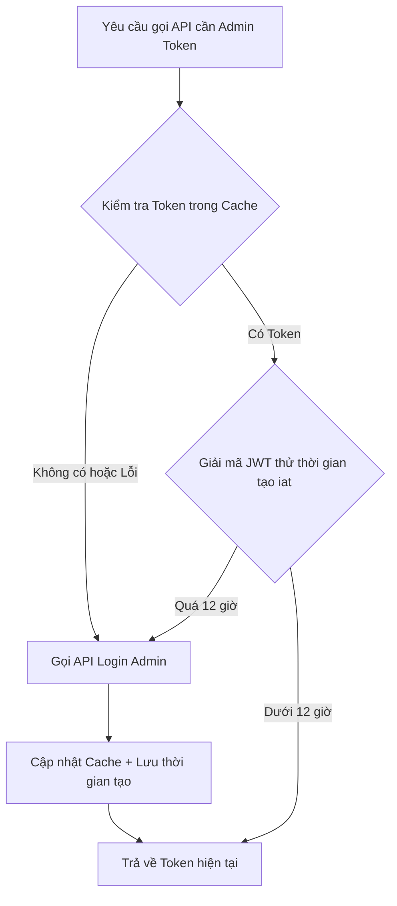
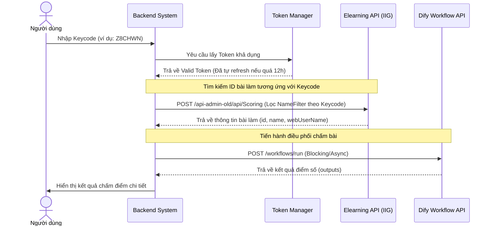

# Tài liệu Thiết kế Hệ thống Quản lý Chấm bài Tự động (AI Scoring Admin)

Tài liệu này đặc tả yêu cầu nghiệp vụ và kiến trúc kỹ thuật cho hệ thống Backend riêng biệt, nhằm thay thế việc sử dụng Google Sheet và các node HTTP thủ công trên Dify, hướng tới quản lý tập trung và tự động hóa hoàn toàn.

---

## 1. Mục tiêu Hệ thống

* **Tự động hóa lấy dữ liệu:** Lấy trực tiếp thông tin bài thi (ID bài làm, thông tin câu hỏi) từ hệ thống Elearning qua API, không qua file Excel/Sheet trung gian.
* **Quản lý Token tập trung:** Tự động đăng nhập, lưu trữ, kiểm tra thời hạn và gia hạn Token quản trị viên (Admin Token) để phục vụ cho tất cả các kết nối tới Elearning API.
* **Điều phối Chấm bài:** Quản lý hàng đợi và điều phối cuộc gọi chấm bài sang Dify API một cách an toàn và tối ưu thời gian.

---

## 2. Thiết kế Cơ chế Quản lý Token (Token Manager)

Hệ thống cần một module chuyên trách quản lý trạng thái Token để tránh việc gọi API login quá nhiều lần và đảm bảo token luôn khả dụng.



### Chi tiết thiết kế Module Token:
1. **Lưu trữ (Caching):** Token được lưu trữ trong Database hoặc cấu hình file cục bộ (như `token_state.json`) dưới dạng:
   ```json
   {
     "accessToken": "Bearer eyJhbGciOi...",
     "updatedAt": 1782831116
   }
   ```
2. **Kiểm tra thời hạn (Validation):**
   * Đọc và giải mã payload JWT để lấy trường `iat` (Issued At) hoặc dựa vào `updatedAt` lưu trong cache.
   * Tính khoảng cách thời gian: `Thời gian hiện tại - Thời gian tạo`.
   * Nếu hiệu số $> 12 \text{ giờ}$, hệ thống sẽ tự động kích hoạt tiến trình làm mới.

---

## 3. Quy trình Xử lý khi Nhập Keycode

Khi người dùng nhập một hoặc nhiều Keycode (ví dụ: `Z8CHWN`), Backend sẽ thực hiện luồng sau:



---

## 4. Đặc tả API Elearning cần Tích hợp

### 4.1. API Đăng nhập lấy Token
* **URL:** `POST https://elearningapi.iigvietnam.com/identity/api/Auth/login-admin`
* **Headers:** Chứa API Key cố định của IIG.
* **Payload:**
  ```json
  {
    "username": "Nhan.ND",
    "password": "BAIIG@2025"
  }
  ```

### 4.2. API Tìm kiếm bài làm theo Keycode
* **URL:** `POST https://elearningapi.iigvietnam.com/api-admin-old/api/Scoring`
* **Payload tìm kiếm:**
  ```json
  {
    "Keyword": null,
    "PageNum": 1,
    "PageSize": 50,
    "StatusesFilter": [],
    "NameFilter": ["<KeyCode>-*"], // Tìm chính xác theo mẫu tên chứa KeyCode từ dropdown
    "UnitOrCourseTestFilter": [], "LessonFilter": [], "StepFilter": [], "ActiveScoringFilter": []
  }
  ```

---

## 5. Kế hoạch Triển khai Code Backend

Chúng ta sẽ xây dựng cấu trúc mã nguồn Backend trong thư mục `AI Scoring Admin` gồm các thành phần:
1. **`token_manager.py`**: Chứa logic kiểm tra, lưu cache và gia hạn Token tự động.
2. **`scoring_client.py`**: Chứa logic kết nối API Elearning để tìm ID dựa vào Keycode.
3. **`dify_client.py`**: Chứa logic kết nối và gọi workflow Dify chấm bài.
4. **`main.py` / CLI**: Điểm khởi chạy hệ thống, nhận tham số đầu vào là Keycode.
